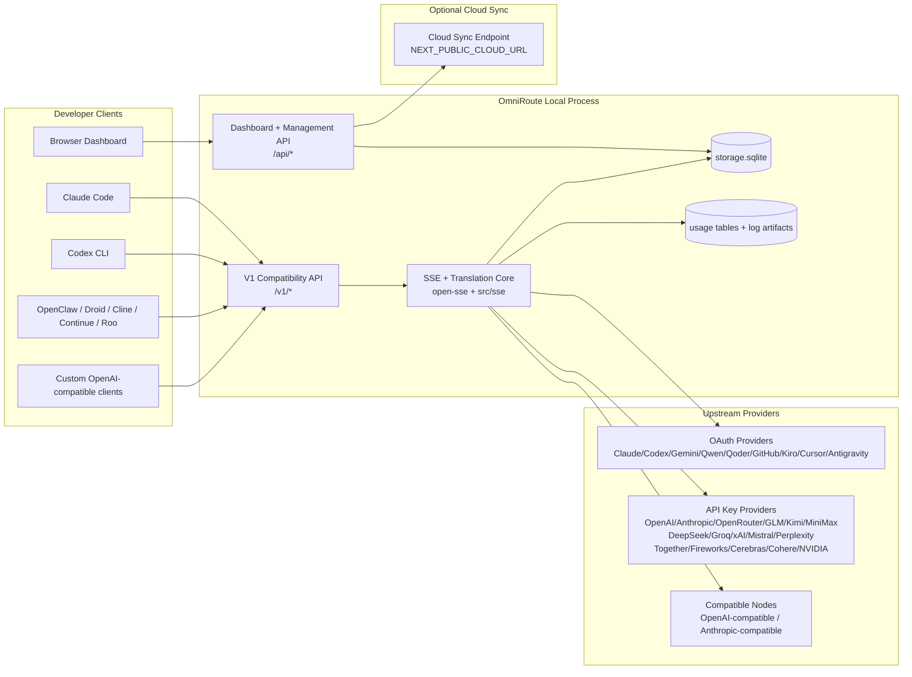
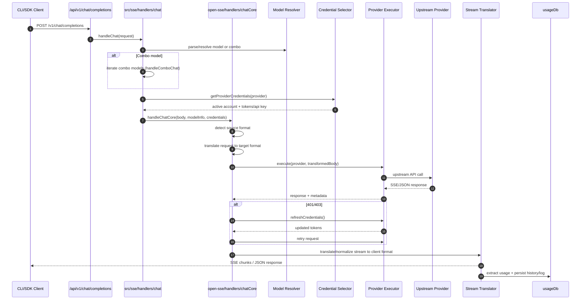
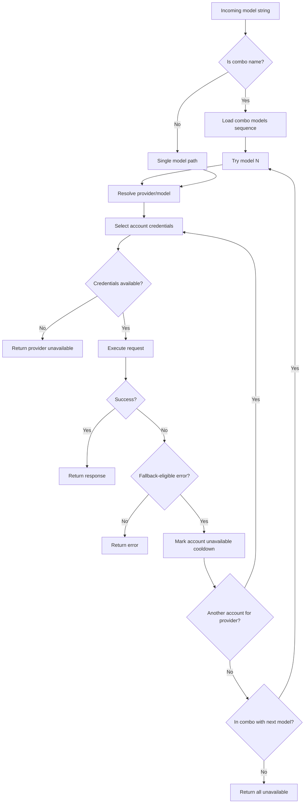
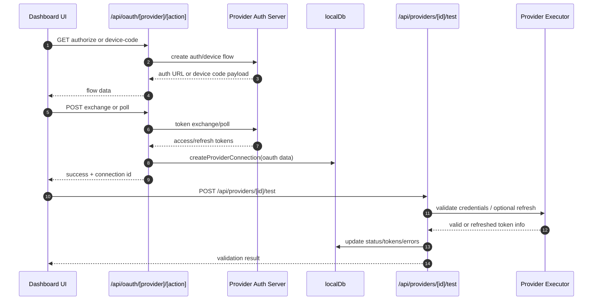
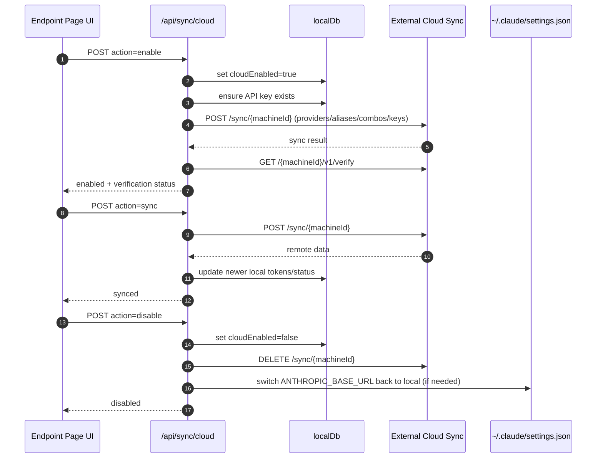
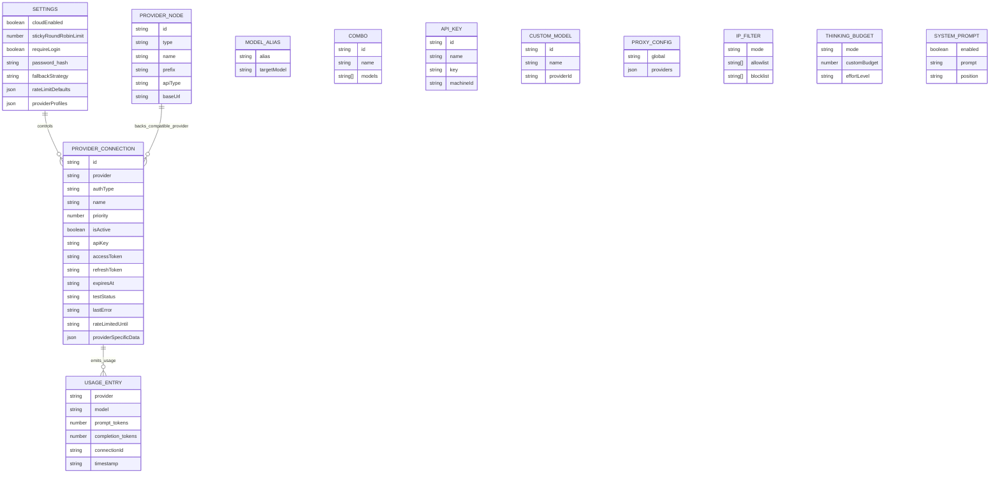
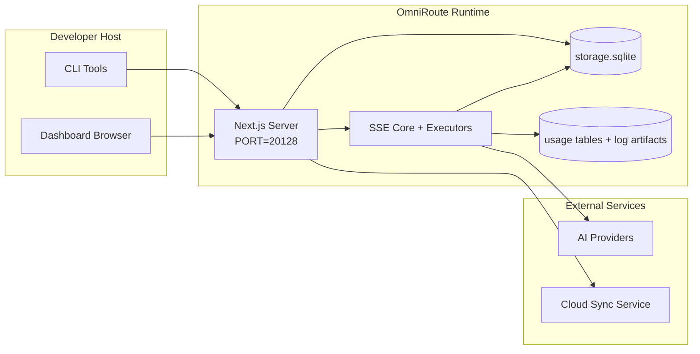

# OmniRoute Architecture

🌐 **Languages:** 🇺🇸 [English](./ARCHITECTURE.md) | 🇧🇷 [Português (Brasil)](../i18n/pt-BR/docs/architecture/ARCHITECTURE.md) | 🇪🇸 [Español](../i18n/es/docs/architecture/ARCHITECTURE.md) | 🇫🇷 [Français](../i18n/fr/docs/architecture/ARCHITECTURE.md) | 🇮🇹 [Italiano](../i18n/it/docs/architecture/ARCHITECTURE.md) | 🇷🇺 [Русский](../i18n/ru/docs/architecture/ARCHITECTURE.md) | 🇨🇳 [中文 (简体)](../i18n/zh-CN/docs/architecture/ARCHITECTURE.md) | 🇩🇪 [Deutsch](../i18n/de/docs/architecture/ARCHITECTURE.md) | 🇮🇳 [हिन्दी](../i18n/in/docs/architecture/ARCHITECTURE.md) | 🇹🇭 [ไทย](../i18n/th/docs/architecture/ARCHITECTURE.md) | 🇺🇦 [Українська](../i18n/uk-UA/docs/architecture/ARCHITECTURE.md) | 🇸🇦 [العربية](../i18n/ar/docs/architecture/ARCHITECTURE.md) | 🇯🇵 [日本語](../i18n/ja/docs/architecture/ARCHITECTURE.md) | 🇻🇳 [Tiếng Việt](../i18n/vi/docs/architecture/ARCHITECTURE.md) | 🇧🇬 [Български](../i18n/bg/docs/architecture/ARCHITECTURE.md) | 🇩🇰 [Dansk](../i18n/da/docs/architecture/ARCHITECTURE.md) | 🇫🇮 [Suomi](../i18n/fi/docs/architecture/ARCHITECTURE.md) | 🇮🇱 [עברית](../i18n/he/docs/architecture/ARCHITECTURE.md) | 🇭🇺 [Magyar](../i18n/hu/docs/architecture/ARCHITECTURE.md) | 🇮🇩 [Bahasa Indonesia](../i18n/id/docs/architecture/ARCHITECTURE.md) | 🇰🇷 [한국어](../i18n/ko/docs/architecture/ARCHITECTURE.md) | 🇲🇾 [Bahasa Melayu](../i18n/ms/docs/architecture/ARCHITECTURE.md) | 🇳🇱 [Nederlands](../i18n/nl/docs/architecture/ARCHITECTURE.md) | 🇳🇴 [Norsk](../i18n/no/docs/architecture/ARCHITECTURE.md) | 🇵🇹 [Português (Portugal)](../i18n/pt/docs/architecture/ARCHITECTURE.md) | 🇷🇴 [Română](../i18n/ro/docs/architecture/ARCHITECTURE.md) | 🇵🇱 [Polski](../i18n/pl/docs/architecture/ARCHITECTURE.md) | 🇸🇰 [Slovenčina](../i18n/sk/docs/architecture/ARCHITECTURE.md) | 🇸🇪 [Svenska](../i18n/sv/docs/architecture/ARCHITECTURE.md) | 🇵🇭 [Filipino](../i18n/phi/docs/architecture/ARCHITECTURE.md) | 🇨🇿 [Čeština](../i18n/cs/docs/architecture/ARCHITECTURE.md)

_Last updated: 2026-05-13_

## Executive Summary

OmniRoute is a local AI routing gateway and dashboard built on Next.js.
It provides a single OpenAI-compatible endpoint (`/v1/*`) and routes traffic across multiple upstream providers with translation, fallback, token refresh, and usage tracking.

Core capabilities:

- OpenAI-compatible API surface for CLI/tools (177 providers, 38 executors)
- Request/response translation across provider formats
- Model combo fallback (multi-model sequence)
- Structured combo steps (`provider + model + connection`) with runtime ordering by `compositeTiers`
- Account-level fallback (multi-account per provider)
- Quota preflight and quota-aware P2C account selection in the main chat path
- OAuth + API-key provider connection management (14 OAuth modules)
- Embedding generation via `/v1/embeddings` (6 providers, 9 models)
- Image generation via `/v1/images/generations` (10+ providers, 20+ models)
- Audio transcription via `/v1/audio/transcriptions` (7 providers)
- Text-to-speech via `/v1/audio/speech` (10 providers)
- Video generation via `/v1/videos/generations` (ComfyUI + SD WebUI)
- Music generation via `/v1/music/generations` (ComfyUI)
- Web search via `/v1/search` (5 providers)
- Moderations via `/v1/moderations`
- Reranking via `/v1/rerank`
- Think tag parsing (`<think>...</think>`) for reasoning models
- Response sanitization for strict OpenAI SDK compatibility
- Role normalization (developer→system, system→user) for cross-provider compatibility
- Structured output conversion (json_schema → Gemini responseSchema)
- Local persistence for providers, keys, aliases, combos, settings, pricing (26 DB modules)
- Usage/cost tracking and request logging
- Optional cloud sync for multi-device/state sync
- IP allowlist/blocklist for API access control
- Thinking budget management (passthrough/auto/custom/adaptive)
- Global system prompt injection
- Session tracking and fingerprinting
- Per-account enhanced rate limiting with provider-specific profiles
- Circuit breaker pattern for provider resilience
- Anti-thundering herd protection with mutex locking
- Signature-based request deduplication cache
- Domain layer: cost rules, fallback policy, lockout policy
- Context Relay: session handoff summaries for account rotation continuity
- Domain state persistence (SQLite write-through cache for fallbacks, budgets, lockouts, circuit breakers)
- Policy engine for centralized request evaluation (lockout → budget → fallback)
- Request telemetry with p50/p95/p99 latency aggregation
- Combo target telemetry and historical combo target health via `combo_execution_key` / `combo_step_id`
- Correlation ID (X-Request-Id) for end-to-end tracing
- Compliance audit logging with opt-out per API key
- Eval framework for LLM quality assurance
- Health dashboard with real-time provider circuit breaker status
- MCP Server (37 tools) with 3 transports (stdio/SSE/Streamable HTTP)
- A2A Server (JSON-RPC 2.0 + SSE) with skills and task lifecycle
- Memory system (extraction, injection, retrieval, summarization)
- Skills system (registry, executor, sandbox, built-in skills)
- MITM proxy with certificate management and DNS handling
- Prompt injection guard middleware
- Prompt compression pipeline with Caveman, RTK, stacked pipelines, compression combos, language packs, and analytics
- ACP (Agent Communication Protocol) registry
- Modular OAuth providers (14 individual modules under `src/lib/oauth/providers/`)
- Uninstall/full-uninstall scripts
- OAuth environment repair action
- WebSocket bridge for OpenAI-compatible WS clients (`/v1/ws`)
- Sync token management (issue/revoke, ETag-versioned config bundle download)
- GLM Thinking (`glmt`) first-class provider preset
- Hybrid token counting (provider-side `/messages/count_tokens` with estimation fallback)
- Model alias auto-seeding (30+ cross-proxy dialect normalizations at startup)
- Safe outbound fetch with SSRF guard, private URL blocking, and configurable retry
- Cooldown-aware chat retries with configurable `requestRetry` and `maxRetryIntervalSec`
- Runtime environment validation with Zod at startup
- Compliance audit v2 with pagination, provider CRUD events, and SSRF-blocked validation logging

Primary runtime model:

- Next.js app routes under `src/app/api/*` implement both dashboard APIs and compatibility APIs
- A shared SSE/routing core in `src/sse/*` + `open-sse/*` handles provider execution, translation, streaming, fallback, and usage

## Reference Diagrams

Canonical, version-controlled Mermaid sources for the v3.8.0 platform live in
[`docs/diagrams/`](../diagrams/README.md). Two are reproduced below for orientation;
the rest are linked from their domain-specific guides.


> Source: [diagrams/request-pipeline.mmd](../diagrams/request-pipeline.mmd)


> Source: [diagrams/resilience-3layers.mmd](../diagrams/resilience-3layers.mmd) — also linked from
> [RESILIENCE_GUIDE.md](./RESILIENCE_GUIDE.md) and the `CLAUDE.md` resilience reference.

## Scope and Boundaries

### In Scope

- Local gateway runtime
- Dashboard management APIs
- Provider authentication and token refresh
- Request translation and SSE streaming
- Local state + usage persistence
- Optional cloud sync orchestration

### Out of Scope

- Cloud service implementation behind `NEXT_PUBLIC_CLOUD_URL`
- Provider SLA/control plane outside local process
- External CLI binaries themselves (Claude CLI, Codex CLI, etc.)

## Dashboard Surface (Current)

Main pages under `src/app/(dashboard)/dashboard/`:

- `/dashboard` — quick start + provider overview
- `/dashboard/endpoint` — endpoint proxy + MCP + A2A + API endpoint tabs
- `/dashboard/providers` — provider connections and credentials
- `/dashboard/combos` — combo strategies, templates, step-based builder, model routing rules, manual persisted ordering
- `/dashboard/auto-combo` — Auto Combo Engine: scoring weights, mode packs, virtual factory presets, telemetry
- `/dashboard/costs` — cost aggregation and pricing visibility
- `/dashboard/analytics` — usage analytics, evaluations, combo target health
- `/dashboard/limits` — quota/rate controls
- `/dashboard/cli-tools` — CLI onboarding, runtime detection, config generation
- `/dashboard/agents` — detected ACP agents + custom agent registration
- `/dashboard/cloud-agents` — cloud-hosted agent tasks (Codex Cloud, Devin, Jules) and task lifecycle
- `/dashboard/skills` — A2A skill registry, sandbox execution, built-in skill catalog
- `/dashboard/memory` — persistent conversational memory inspection and retrieval
- `/dashboard/webhooks` — outbound webhook subscriptions, secret rotation, retry stats
- `/dashboard/batch` — batch job submission and progress
- `/dashboard/cache` — read-through and reasoning cache statistics, eviction controls
- `/dashboard/playground` — interactive chat playground against any configured combo/model
- `/dashboard/changelog` — in-app changelog viewer (renders `CHANGELOG.md`)
- `/dashboard/system` — runtime diagnostics, version info, environment validation surface
- `/dashboard/onboarding` — first-run setup wizard for new installations
- `/dashboard/media` — image/video/music playground
- `/dashboard/search-tools` — search provider testing and history
- `/dashboard/health` — uptime, circuit breakers, rate limits, quota-monitored sessions
- `/dashboard/logs` — request/proxy/audit/console logs
- `/dashboard/settings` — system settings tabs (general, routing, combo defaults, etc.)
- `/dashboard/context/caveman` — Caveman compression rules, language packs, preview, and output mode
- `/dashboard/context/rtk` — RTK command-output filters, preview, and runtime safety settings
- `/dashboard/context/combos` — named compression pipelines assigned to routing combos
- `/dashboard/translator` — translator inspection and request format conversion preview
- `/dashboard/audit` — compliance audit log browser with pagination and structured metadata
- `/dashboard/usage` — per-request usage browser tied to `usage_history`
- `/dashboard/compression` — compression analytics, statistics, and pipeline assignment
- `/dashboard/api-manager` — API key lifecycle and model permissions

## High-Level System Context



## Core Runtime Components

## 1) API and Routing Layer (Next.js App Routes)

Main directories:

- `src/app/api/v1/*` and `src/app/api/v1beta/*` for compatibility APIs
- `src/app/api/*` for management/configuration APIs
- Next rewrites in `next.config.mjs` map `/v1/*` to `/api/v1/*`

Important compatibility routes:

- `src/app/api/v1/chat/completions/route.ts`
- `src/app/api/v1/messages/route.ts`
- `src/app/api/v1/responses/route.ts`
- `src/app/api/v1/models/route.ts` — includes custom models with `custom: true`
- `src/app/api/v1/embeddings/route.ts` — embedding generation (6 providers)
- `src/app/api/v1/images/generations/route.ts` — image generation (4+ providers incl. Antigravity/Nebius)
- `src/app/api/v1/messages/count_tokens/route.ts`
- `src/app/api/v1/providers/[provider]/chat/completions/route.ts` — dedicated per-provider chat
- `src/app/api/v1/providers/[provider]/embeddings/route.ts` — dedicated per-provider embeddings
- `src/app/api/v1/providers/[provider]/images/generations/route.ts` — dedicated per-provider images
- `src/app/api/v1beta/models/route.ts`
- `src/app/api/v1beta/models/[...path]/route.ts`

Management domains:

- Auth/settings: `src/app/api/auth/*`, `src/app/api/settings/*`
- Providers/connections: `src/app/api/providers*`
- Provider nodes: `src/app/api/provider-nodes*`
- Custom models: `src/app/api/provider-models` (GET/POST/DELETE)
- Model catalog: `src/app/api/models/route.ts` (GET)
- Proxy config: `src/app/api/settings/proxy` (GET/PUT/DELETE) + `src/app/api/settings/proxy/test` (POST)
- OAuth: `src/app/api/oauth/*`
- Keys/aliases/combos/pricing: `src/app/api/keys*`, `src/app/api/models/alias`, `src/app/api/combos*`, `src/app/api/pricing`
- Usage: `src/app/api/usage/*`
- Sync/cloud: `src/app/api/sync/*`, `src/app/api/cloud/*`
- CLI tooling helpers: `src/app/api/cli-tools/*`
- IP filter: `src/app/api/settings/ip-filter` (GET/PUT)
- Thinking budget: `src/app/api/settings/thinking-budget` (GET/PUT)
- System prompt: `src/app/api/settings/system-prompt` (GET/PUT)
- Compression: `src/app/api/settings/compression`, `src/app/api/compression/*`, and
  `src/app/api/context/*`
- Sessions: `src/app/api/sessions` (GET)
- Rate limits: `src/app/api/rate-limits` (GET)
- Resilience: `src/app/api/resilience` (GET/PATCH) — request queue, connection cooldown, provider breaker, wait-for-cooldown config
- Resilience reset: `src/app/api/resilience/reset` (POST) — reset provider breakers
- Cache stats: `src/app/api/cache/stats` (GET/DELETE)
- Telemetry: `src/app/api/telemetry/summary` (GET)
- Budget: `src/app/api/usage/budget` (GET/POST)
- Fallback chains: `src/app/api/fallback/chains` (GET/POST/DELETE)
- Compliance audit: `src/app/api/compliance/audit-log` (GET, with pagination + structured metadata)
- Evals: `src/app/api/evals` (GET/POST), `src/app/api/evals/[suiteId]` (GET)
- Policies: `src/app/api/policies` (GET/POST)
- Sync tokens: `src/app/api/sync/tokens` (GET/POST), `src/app/api/sync/tokens/[id]` (GET/DELETE)
- Config bundle: `src/app/api/sync/bundle` (GET, ETag-versioned snapshot of settings/providers/combos/keys)
- WebSocket: `src/app/api/v1/ws/route.ts` — Upgrade handler for OpenAI-compatible WS clients

## 2) SSE + Translation Core

Main flow modules:

- Entry: `src/sse/handlers/chat.ts`
- Core orchestration: `open-sse/handlers/chatCore.ts`
- Provider execution adapters: `open-sse/executors/*`
- Format detection/provider config: `open-sse/services/provider.ts`
- Model parse/resolve: `src/sse/services/model.ts`, `open-sse/services/model.ts`
- Account fallback logic: `open-sse/services/accountFallback.ts`
- Translation registry: `open-sse/translator/index.ts`
- Stream transformations: `open-sse/utils/stream.ts`, `open-sse/utils/streamHandler.ts`
- Usage extraction/normalization: `open-sse/utils/usageTracking.ts`
- Think tag parser: `open-sse/utils/thinkTagParser.ts`
- Embedding handler: `open-sse/handlers/embeddings.ts`
- Embedding provider registry: `open-sse/config/embeddingRegistry.ts`
- Image generation handler: `open-sse/handlers/imageGeneration.ts`
- Image provider registry: `open-sse/config/imageRegistry.ts`
- Response sanitization: `open-sse/handlers/responseSanitizer.ts`
- Role normalization: `open-sse/services/roleNormalizer.ts`

Services (business logic):

- Account selection/scoring: `open-sse/services/accountSelector.ts`
- Context lifecycle management: `open-sse/services/contextManager.ts`
- IP filter enforcement: `open-sse/services/ipFilter.ts`
- Session tracking: `open-sse/services/sessionManager.ts`
- Request deduplication: `open-sse/services/signatureCache.ts`
- System prompt injection: `open-sse/services/systemPrompt.ts`
- Thinking budget management: `open-sse/services/thinkingBudget.ts`
- Wildcard model routing: `open-sse/services/wildcardRouter.ts`
- Rate limit management: `open-sse/services/rateLimitManager.ts`
- Circuit breaker: `open-sse/services/circuitBreaker.ts`
- Context handoff: `open-sse/services/contextHandoff.ts` — handoff summary generation and injection for context-relay strategy
- Compression: `open-sse/services/compression/*` — proactive compression before provider translation;
  includes Caveman rules, RTK filters, stacked pipelines, compression combos, stats, and validation
- Codex quota fetcher: `open-sse/services/codexQuotaFetcher.ts` — fetches Codex quota for context-relay handoff decisions
- Cooldown-aware retry: `src/sse/services/cooldownAwareRetry.ts` — per-model cooldown retries with configurable `requestRetry` / `maxRetryIntervalSec`
- Safe outbound fetch: `src/shared/network/safeOutboundFetch.ts` — guarded provider/model fetch with SSRF guard, private-URL blocking, retry, and timeout
- Outbound URL guard: `src/shared/network/outboundUrlGuard.ts` — validates provider URLs against private/localhost CIDR ranges
- Provider request defaults: `open-sse/services/providerRequestDefaults.ts` — provider-level `maxTokens`, `temperature`, `thinkingBudgetTokens` defaults
- GLM provider constants: `open-sse/config/glmProvider.ts` — shared GLM models, quota URLs, GLMT timeout/defaults
- Antigravity upstream: `open-sse/config/antigravityUpstream.ts` — base URL and discovery path constants
- Codex client constants: `open-sse/config/codexClient.ts` — versioned user-agent and client-version values
- Model alias seed: `src/lib/modelAliasSeed.ts` — seeds 30+ cross-proxy dialect aliases at startup

Domain layer modules:

- Cost rules/budgets: `src/lib/domain/costRules.ts`
- Fallback policy: `src/lib/domain/fallbackPolicy.ts`
- Combo resolver: `src/lib/domain/comboResolver.ts`
- Lockout policy: `src/lib/domain/lockoutPolicy.ts`
- Policy engine: `src/domain/policyEngine.ts` — centralized lockout → budget → fallback evaluation
- Error codes catalog: `src/lib/domain/errorCodes.ts`
- Request ID: `src/lib/domain/requestId.ts`
- Fetch timeout: `src/lib/domain/fetchTimeout.ts`
- Request telemetry: `src/lib/domain/requestTelemetry.ts`
- Compliance/audit: `src/lib/domain/compliance/index.ts`
- Eval runner: `src/lib/domain/evalRunner.ts`
- Domain state persistence: `src/lib/db/domainState.ts` — SQLite CRUD for fallback chains, budgets, cost history, lockout state, circuit breakers

OAuth provider modules (14 individual files under `src/lib/oauth/providers/`):

- Registry index: `src/lib/oauth/providers/index.ts`
- Individual providers: `claude.ts`, `codex.ts`, `gemini.ts`, `antigravity.ts`, `qoder.ts`, `qwen.ts`, `kimi-coding.ts`, `github.ts`, `kiro.ts`, `cursor.ts`, `kilocode.ts`, `cline.ts`, `windsurf.ts`, `gitlab-duo.ts`
- Thin wrapper: `src/lib/oauth/providers.ts` — re-exports from individual modules

## Major Subsystems (v3.8.0)

### A. Auto Combo Engine

Auto Combo dynamically scores and picks routing targets at request time, rather than
relying on a static combo definition. It powers the `auto/*` model prefix family.

- Engine entry: `open-sse/services/autoCombo/` (`autoComboEngine.ts`,
  `scoringEngine.ts`, `virtualFactory.ts`, `modePacks.ts`)
- Resolver: `src/domain/comboResolver.ts` (auto-detection of `auto/` prefix)
- Dashboard: `/dashboard/auto-combo`
- Telemetry: `auto_combo_decisions` SQLite table

Key capabilities:

- **14 routing strategies** (priority, weighted, fill-first, round-robin, P2C, random,
  least-used, cost-optimized, strict-random, **auto**, lkgp, context-optimized,
  context-relay, plus a fallback path) — auto is the headline addition in v3.8.0.
- **9-factor scoring**: cost, latency p95, success rate, quota headroom, lockout
  proximity, breaker state, recent failures, model availability, and tag affinity.
- **Virtual factory** materializes ephemeral combos when no matching named combo
  exists, sourcing candidates from healthy active provider connections.
- **Auto prefixes**: `auto/coding`, `auto/cheap`, `auto/fast`, `auto/offline`,
  `auto/smart`, `auto/lkgp` — each backed by a tuned weight profile.
- **4 mode packs**: coding, fast, cheap, smart — shipped as preset weight
  configurations callable from the dashboard.

For full algorithmic detail (factor formulas, weight tuning), see
[`docs/routing/AUTO-COMBO.md`](../routing/AUTO-COMBO.md).

### B. Cloud Agents

Cloud Agents wraps third-party hosted code-agent platforms (Codex Cloud, Devin,
Jules) behind a uniform DB-backed task lifecycle. All task creation/inspection
endpoints require management authentication.

- Module root: `src/lib/cloudAgent/` (`baseAgent.ts`, `registry.ts`, `api.ts`,
  `types.ts`, `db.ts`, plus per-agent subdirectories under `agents/`)
- Per-agent implementations: `agents/codex/`, `agents/devin/`, `agents/jules/`
- Public endpoints: `/api/v1/agents/tasks/*` (list/create/get/cancel)
- Management endpoints: `/api/cloud/*` (provisioning, status, batch)
- Dashboard: `/dashboard/cloud-agents`
- Storage: `cloud_agent_tasks` table

For per-agent provisioning and OAuth specifics, see
[`docs/frameworks/CLOUD_AGENT.md`](../frameworks/CLOUD_AGENT.md).

### C. Guardrails

The guardrails module is a hot-reloadable middleware layer that inspects requests
and responses for PII, prompt injection, and unsafe vision content. Violations
short-circuit the request with HTTP **503** plus a structured error code, allowing
downstream callers to retry or branch.

- Module root: `src/lib/guardrails/` (`base.ts`, `registry.ts`, `piiMasker.ts`,
  `promptInjection.ts`, `visionBridge.ts`, `visionBridgeHelpers.ts`)
- Hot reload: registry watches for config changes and rebuilds the chain in place
- Wire-in points: chat handler entry, image generation handler, response sanitizer
- HTTP contract: violations surface as `503` with `error.code = "GUARDRAIL_VIOLATION"`

For ruleset authoring and threshold tuning, see
[`docs/security/GUARDRAILS.md`](../security/GUARDRAILS.md).

### D. Domain Layer

The `src/domain/` namespace centralizes policy decisions so route handlers do not
have to assemble lockout/budget/fallback logic themselves.

- Policy engine: `src/domain/policyEngine.ts` — single entry point for
  pre-execution evaluation (lockout → budget → fallback ordering)
- Cost rules: `src/domain/costRules.ts`
- Fallback policy: `src/domain/fallbackPolicy.ts`
- Lockout policy: `src/domain/lockoutPolicy.ts`
- Tag-based routing: `src/domain/tagRouter.ts`
- Combo resolver: `src/domain/comboResolver.ts` — resolves combo names, auto/\*
  prefixes, and wildcard model targets to concrete execution plans
- Connection/model rule joiner: `src/domain/connectionModelRules.ts`
- Model availability snapshots: `src/domain/modelAvailability.ts`
- Provider expiration tracking: `src/domain/providerExpiration.ts`
- Quota cache: `src/domain/quotaCache.ts`
- Degradation state: `src/domain/degradation.ts`
- Configuration audit: `src/domain/configAudit.ts`
- OmniRoute response metadata builder: `src/domain/omnirouteResponseMeta.ts`
- Assessment subsystem: `src/domain/assessment/` — periodic evaluation jobs

### E. Authorization Pipeline

The authorization pipeline classifies every incoming request and applies the
appropriate policy chain before dispatch.

- Pipeline entry: `src/server/authz/pipeline.ts`
- Request classifier: `src/server/authz/classify.ts` — distinguishes public
  compatibility routes from management routes
- Public route inventory: `src/shared/constants/publicApiRoutes.ts`
- Policies: `src/server/authz/policies/` — composable predicates
  (`requireApiKey`, `requireManagement`, `requireFreshAuth`, etc.)
- Header utilities: `src/server/authz/headers.ts`
- Assertion helper: `src/server/authz/assertAuth.ts`
- Request context: `src/server/authz/context.ts`

Public vs management routes are a hard boundary: agent/cooldown APIs and
provider mutations require management auth (HTTP 401 if missing).

For the full route classification rules, see
[`docs/architecture/AUTHZ_GUIDE.md`](./AUTHZ_GUIDE.md).

### F. Workflow FSM and Task-Aware Router

A finite-state-machine driven router layered above combo selection to direct
traffic based on the detected workflow stage (planning, execution,
review) and background-task affinity.

- Workflow FSM: `open-sse/services/workflowFSM.ts`
- Task-aware router: `open-sse/services/taskAwareRouter.ts`
- Background task detector: `open-sse/services/backgroundTaskDetector.ts`
- Intent classifier: `open-sse/services/intentClassifier.ts`

The FSM transitions feed into Auto Combo's scoring, biasing toward cheaper models
for background/automation tasks and toward stronger models for interactive
planning/review turns.

### G. Provider-Specific Resilience

Several providers ship dedicated resilience and stealth modules that piggy-back on
the global circuit breaker / connection cooldown / model lockout layers:

- Antigravity 429 engine: `open-sse/services/antigravity429Engine.ts` (rotates
  identity, scrubs response headers, drives credits/version tracking via
  `antigravityCredits.ts`, `antigravityHeaderScrub.ts`, `antigravityHeaders.ts`,
  `antigravityIdentity.ts`, `antigravityObfuscation.ts`, `antigravityVersion.ts`)
- ModelScope quota policy: `open-sse/services/modelscopePolicy.ts`
- Claude Code CCH (Compatibility Channel Handshake): `open-sse/services/claudeCodeCCH.ts`,
  plus `claudeCodeCompatible.ts`, `claudeCodeConstraints.ts`, `claudeCodeExtraRemap.ts`,
  `claudeCodeToolRemapper.ts`
- Claude Code fingerprint shaping: `open-sse/services/claudeCodeFingerprint.ts`
- Claude Code obfuscation: `open-sse/services/claudeCodeObfuscation.ts`
- ChatGPT TLS client: `open-sse/services/chatgptTlsClient.ts` (curl-impersonate
  style for ChatGPT-Web sessions)
- ChatGPT image cache: `open-sse/services/chatgptImageCache.ts`

For the full stealth playbook and operational guidance, see
[`docs/security/STEALTH_GUIDE.md`](../security/STEALTH_GUIDE.md).

### H. Webhooks, Reasoning Cache, Read Cache

- **Webhooks** — outbound dispatch for provider/account/task events.
  - Dispatcher: `src/lib/webhookDispatcher.ts`
  - Storage: `webhooks` SQLite table (via `src/lib/db/webhooks.ts`)
  - Dashboard: `/dashboard/webhooks` (subscriptions, secrets, retry history)
  - For event taxonomy and retry semantics, see [`docs/frameworks/WEBHOOKS.md`](../frameworks/WEBHOOKS.md).
- **Reasoning Cache** — replayable reasoning blocks for providers that emit
  thinking tokens (Claude, GLMT, etc.) so consecutive turns can skip re-thinking.
  - DB layer: `src/lib/db/reasoningCache.ts`
  - Service layer: `open-sse/services/reasoningCache.ts`
  - For replay semantics, see [`docs/routing/REASONING_REPLAY.md`](../routing/REASONING_REPLAY.md).
- **Read Cache** — short-lived response cache keyed by signature and used to
  collapse identical retries from broken upstream SDKs.
  - DB layer: `src/lib/db/readCache.ts`
  - Stats endpoint: `GET /api/cache/stats`, dashboard at `/dashboard/cache`

## 3) Persistence Layer

Primary state DB (SQLite):

- Core infra: `src/lib/db/core.ts` (better-sqlite3, migrations, WAL)
- Re-export facade: `src/lib/localDb.ts` (thin compatibility layer for callers)
- file: `${DATA_DIR}/storage.sqlite` (or `$XDG_CONFIG_HOME/omniroute/storage.sqlite` when set, else `~/.omniroute/storage.sqlite`)
- entities (tables + KV namespaces): providerConnections, providerNodes, modelAliases, combos, apiKeys, settings, pricing, **customModels**, **proxyConfig**, **ipFilter**, **thinkingBudget**, **systemPrompt**

Usage persistence:

- facade: `src/lib/usageDb.ts` (decomposed modules in `src/lib/usage/*`)
- SQLite tables in `storage.sqlite`: `usage_history`, `call_logs`, `proxy_logs`
- optional file artifacts remain for compatibility/debug (`${DATA_DIR}/log.txt`, `${DATA_DIR}/call_logs/`, `<repo>/logs/...`)
- legacy JSON files are migrated to SQLite by startup migrations when present

Domain State DB (SQLite):

- `src/lib/db/domainState.ts` — CRUD operations for domain state
- Tables (created in `src/lib/db/core.ts`): `domain_fallback_chains`, `domain_budgets`, `domain_cost_history`, `domain_lockout_state`, `domain_circuit_breakers`
- Write-through cache pattern: in-memory Maps are authoritative at runtime; mutations are written synchronously to SQLite; state is restored from DB on cold start

## 4) Auth + Security Surfaces

- Dashboard cookie auth: `src/proxy.ts`, `src/app/api/auth/login/route.ts`
- API key generation/verification: `src/shared/utils/apiKey.ts`
- Provider secrets persisted in `providerConnections` entries
- Outbound proxy support via `open-sse/utils/proxyFetch.ts` (env vars) and `open-sse/utils/networkProxy.ts` (configurable per-provider or global)
- SSRF / outbound URL guard: `src/shared/network/outboundUrlGuard.ts` — blocks private/loopback/link-local ranges for all provider calls
- Runtime env validation: `src/lib/env/runtimeEnv.ts` — Zod schema for all environment variables, surfaced as startup errors/warnings
- Sync tokens: `src/lib/db/syncTokens.ts` — scoped tokens for config bundle download endpoints; backed by `sync_tokens` SQLite table (migration `024_create_sync_tokens.sql`)
- WebSocket handshake auth: `src/lib/ws/handshake.ts` — validates WS upgrade requests via API key or session cookie

## 5) Cloud Sync

- Scheduler init: `src/lib/initCloudSync.ts`, `src/shared/services/initializeCloudSync.ts`, `src/shared/services/modelSyncScheduler.ts`
- Periodic task: `src/shared/services/cloudSyncScheduler.ts`
- Periodic task: `src/shared/services/modelSyncScheduler.ts`
- Control route: `src/app/api/sync/cloud/route.ts`

## Request Lifecycle (`/v1/chat/completions`)



## Combo + Account Fallback Flow



Fallback decisions are driven by `open-sse/services/accountFallback.ts` using status codes and error-message heuristics. Combo routing adds one extra guard: provider-scoped 400s such as upstream content-block and role-validation failures are treated as model-local failures so later combo targets can still run.

## OAuth Onboarding and Token Refresh Lifecycle



Refresh during live traffic is executed inside `open-sse/handlers/chatCore.ts` via executor `refreshCredentials()`.

## Cloud Sync Lifecycle (Enable / Sync / Disable)



Periodic sync is triggered by `CloudSyncScheduler` when cloud is enabled.

## Data Model and Storage Map



Physical storage files:

- primary runtime DB: `${DATA_DIR}/storage.sqlite`
- request log lines: `${DATA_DIR}/log.txt` (compat/debug artifact)
- structured call payload archives: `${DATA_DIR}/call_logs/`
- optional translator/request debug sessions: `<repo>/logs/...`

## Deployment Topology



## Module Mapping (Decision-Critical)

### Route and API Modules

- `src/app/api/v1/*`, `src/app/api/v1beta/*`: compatibility APIs
- `src/app/api/v1/providers/[provider]/*`: dedicated per-provider routes (chat, embeddings, images)
- `src/app/api/providers*`: provider CRUD, validation, testing
- `src/app/api/provider-nodes*`: custom compatible node management
- `src/app/api/provider-models`: custom model management (CRUD)
- `src/app/api/models/route.ts`: model catalog API (aliases + custom models)
- `src/app/api/oauth/*`: OAuth/device-code flows
- `src/app/api/keys*`: local API key lifecycle
- `src/app/api/models/alias`: alias management
- `src/app/api/combos*`: fallback combo management
- `src/app/api/pricing`: pricing overrides for cost calculation
- `src/app/api/settings/proxy`: proxy configuration (GET/PUT/DELETE)
- `src/app/api/settings/proxy/test`: outbound proxy connectivity test (POST)
- `src/app/api/usage/*`: usage and logs APIs
- `src/app/api/sync/*` + `src/app/api/cloud/*`: cloud sync and cloud-facing helpers
- `src/app/api/cli-tools/*`: local CLI config writers/checkers
- `src/app/api/settings/ip-filter`: IP allowlist/blocklist (GET/PUT)
- `src/app/api/settings/thinking-budget`: thinking token budget config (GET/PUT)
- `src/app/api/settings/system-prompt`: global system prompt (GET/PUT)
- `src/app/api/settings/compression`: global compression settings (GET/PUT)
- `src/app/api/compression/*`: compression preview, rule metadata, and language packs
- `src/app/api/context/caveman/config`: Caveman settings alias (GET/PUT)
- `src/app/api/context/rtk/*`: RTK config, filter catalog, test endpoint, and raw-output recovery
- `src/app/api/context/combos*`: compression combo CRUD and routing-combo assignments
- `src/app/api/context/analytics`: compression analytics alias
- `src/app/api/sessions`: active session listing (GET)
- `src/app/api/rate-limits`: per-account rate limit status (GET)
- `src/app/api/sync/tokens`: sync token CRUD (GET/POST)
- `src/app/api/sync/tokens/[id]`: sync token get/delete (GET/DELETE)
- `src/app/api/sync/bundle`: config bundle download (GET, ETag versioning)
- `src/app/api/v1/ws`: WebSocket upgrade handler for OpenAI-compatible WS clients

### Routing and Execution Core

- `src/sse/handlers/chat.ts`: request parse, combo handling, account selection loop
- `open-sse/handlers/chatCore.ts`: translation, executor dispatch, retry/refresh handling, stream setup
- `open-sse/executors/*`: provider-specific network and format behavior

### Translation Registry and Format Converters

- `open-sse/translator/index.ts`: translator registry and orchestration
- Request translators: `open-sse/translator/request/*` (9 modules — `antigravity-to-openai`, `claude-to-gemini`, `claude-to-openai`, `gemini-to-openai`, `openai-responses`, `openai-to-claude`, `openai-to-cursor`, `openai-to-gemini`, `openai-to-kiro`)
- Response translators: `open-sse/translator/response/*` (8 modules — `claude-to-openai`, `cursor-to-openai`, `gemini-to-claude`, `gemini-to-openai`, `kiro-to-openai`, `openai-responses`, `openai-to-antigravity`, `openai-to-claude`)
- Helpers: `open-sse/translator/helpers/*` (8 modules — `claudeHelper`, `geminiHelper`, `geminiToolsSanitizer`, `maxTokensHelper`, `openaiHelper`, `responsesApiHelper`, `schemaCoercion`, `toolCallHelper`)
- Format constants: `open-sse/translator/formats.ts`
- Bootstrap and registry: `open-sse/translator/bootstrap.ts`, `open-sse/translator/registry.ts`
- Image-format helpers: `open-sse/translator/image/`

### Persistence

- `src/lib/db/*`: persistent config/state and domain persistence on SQLite
- `src/lib/localDb.ts`: compatibility re-export for DB modules
- `src/lib/usageDb.ts`: usage history/call logs facade on top of SQLite tables

## Provider Executor Coverage (Strategy Pattern)

Each provider has a specialized executor extending `BaseExecutor` (in `open-sse/executors/base.ts`), which provides URL building, header construction, retry with exponential backoff, credential refresh hooks, and the `execute()` orchestration method.

| Executor                 | Provider(s)                                                                                                                                                 | Special Handling                                                     |
| ------------------------ | ----------------------------------------------------------------------------------------------------------------------------------------------------------- | -------------------------------------------------------------------- |
| `DefaultExecutor`        | OpenAI, Claude, Gemini, Qwen, OpenRouter, GLM, Kimi, MiniMax, DeepSeek, Groq, xAI, Mistral, Perplexity, Together, Fireworks, Cerebras, Cohere, NVIDIA, etc. | Dynamic URL/header config per provider                               |
| `AntigravityExecutor`    | Google Antigravity                                                                                                                                          | Custom project/session IDs, Retry-After parsing, 429 obfuscation     |
| `AzureOpenAIExecutor`    | Azure OpenAI                                                                                                                                                | Deployment-based routing, api-version query enforcement              |
| `BlackboxWebExecutor`    | Blackbox AI (web-mode)                                                                                                                                      | Web-session reverse with TLS fingerprint emulation                   |
| `ChatGPTWebExecutor`     | ChatGPT web                                                                                                                                                 | TLS client + session cookie management (`chatgptTlsClient.ts`)       |
| `ClaudeIdentityExecutor` | Claude.ai (CCH path)                                                                                                                                        | Constraint + tool-remap pipelines, fingerprint shaping               |
| `CliProxyApiExecutor`    | CLIProxyAPI-compatible providers                                                                                                                            | Custom auth and protocol handling                                    |
| `CloudflareAiExecutor`   | Cloudflare Workers AI                                                                                                                                       | Account ID injection, Neurons-based usage tracking                   |
| `CodexExecutor`          | OpenAI Codex                                                                                                                                                | Injects system instructions, forces reasoning effort                 |
| `CommandCodeExecutor`    | Command Code                                                                                                                                                | OAuth + per-session header rotation                                  |
| `CursorExecutor`         | Cursor IDE                                                                                                                                                  | ConnectRPC protocol, Protobuf encoding, request signing via checksum |
| `DevinCliExecutor`       | Devin CLI                                                                                                                                                   | Devin task lifecycle bridging via cloud agent module                 |
| `GeminiCLIExecutor`      | Gemini CLI                                                                                                                                                  | Google OAuth token refresh cycle                                     |
| `GithubExecutor`         | GitHub Copilot                                                                                                                                              | Copilot token refresh, VSCode-mimicking headers                      |
| `GitlabExecutor`         | GitLab Duo                                                                                                                                                  | GitLab OAuth + project-scoped routing                                |
| `GlmExecutor`            | Z.AI GLM (incl. `glmt` preset)                                                                                                                              | Thinking-budget aware, GLMT preset constants                         |
| `GrokWebExecutor`        | xAI Grok web                                                                                                                                                | Web-session reverse, mode selection (think/standard)                 |
| `KieExecutor`            | KIE                                                                                                                                                         | Custom token issuance with rotating session anchors                  |
| `KiroExecutor`           | AWS CodeWhisperer/Kiro                                                                                                                                      | AWS EventStream binary format → SSE conversion                       |
| `MuseSparkWebExecutor`   | Muse Spark (web)                                                                                                                                            | Web-session reverse with image-message bridging                      |
| `NlpCloudExecutor`       | NLP Cloud                                                                                                                                                   | Provider-specific request body shape                                 |
| `OpenCodeExecutor`       | OpenCode                                                                                                                                                    | AI SDK compatible provider setup                                     |
| `PerplexityWebExecutor`  | Perplexity web                                                                                                                                              | Web-session reverse for chat continuation                            |
| `PetalsExecutor`         | Petals distributed inference                                                                                                                                | Decentralized swarm routing                                          |
| `PollinationsExecutor`   | Pollinations AI                                                                                                                                             | No API key required, rate-limited requests                           |
| `PuterExecutor`          | Puter                                                                                                                                                       | Browser-based provider integration                                   |
| `QoderExecutor`          | Qoder AI                                                                                                                                                    | PAT and OAuth support, multi-model free tier                         |
| `VertexExecutor`         | Google Vertex AI                                                                                                                                            | Service account auth, region-based endpoints                         |
| `WindsurfExecutor`       | Windsurf (Codeium)                                                                                                                                          | Codeium OAuth + session token refresh                                |

All other providers (including custom compatible nodes) use the `DefaultExecutor`.

## Provider Compatibility Matrix

> **Note:** The matrix below is a representative sample of the 177 registered providers in
> OmniRoute v3.8.0. For the canonical and continuously-updated list, refer to
> [`docs/reference/PROVIDER_REFERENCE.md`](../reference/PROVIDER_REFERENCE.md) (auto-generated) or the source of
> truth at `src/shared/constants/providers.ts` (Zod-validated at load).

| Provider          | Format           | Auth                  | Stream           | Non-Stream | Token Refresh | Usage API          |
| ----------------- | ---------------- | --------------------- | ---------------- | ---------- | ------------- | ------------------ |
| Claude            | claude           | API Key / OAuth       | ✅               | ✅         | ✅            | ⚠️ Admin only      |
| Gemini            | gemini           | API Key / OAuth       | ✅               | ✅         | ✅            | ⚠️ Cloud Console   |
| Gemini CLI        | gemini-cli       | OAuth                 | ✅               | ✅         | ✅            | ⚠️ Cloud Console   |
| Antigravity       | antigravity      | OAuth                 | ✅               | ✅         | ✅            | ✅ Full quota API  |
| OpenAI            | openai           | API Key               | ✅               | ✅         | ❌            | ❌                 |
| Codex             | openai-responses | OAuth                 | ✅ forced        | ❌         | ✅            | ✅ Rate limits     |
| GitHub Copilot    | openai           | OAuth + Copilot Token | ✅               | ✅         | ✅            | ✅ Quota snapshots |
| Cursor            | cursor           | Custom checksum       | ✅               | ✅         | ❌            | ❌                 |
| Kiro              | kiro             | AWS SSO OIDC          | ✅ (EventStream) | ❌         | ✅            | ✅ Usage limits    |
| Qwen              | openai           | OAuth                 | ✅               | ✅         | ✅            | ⚠️ Per request     |
| Qoder             | openai           | OAuth / PAT           | ✅               | ✅         | ✅            | ⚠️ Per request     |
| Kilo Code         | openai           | OAuth                 | ✅               | ✅         | ✅            | ❌                 |
| Cline             | openai           | OAuth                 | ✅               | ✅         | ✅            | ❌                 |
| Kimi Coding       | openai           | OAuth                 | ✅               | ✅         | ✅            | ❌                 |
| OpenRouter        | openai           | API Key               | ✅               | ✅         | ❌            | ❌                 |
| GLM/Kimi/MiniMax  | claude           | API Key               | ✅               | ✅         | ❌            | ❌                 |
| DeepSeek          | openai           | API Key               | ✅               | ✅         | ❌            | ❌                 |
| Groq              | openai           | API Key               | ✅               | ✅         | ❌            | ❌                 |
| xAI (Grok)        | openai           | API Key               | ✅               | ✅         | ❌            | ❌                 |
| Mistral           | openai           | API Key               | ✅               | ✅         | ❌            | ❌                 |
| Perplexity        | openai           | API Key               | ✅               | ✅         | ❌            | ❌                 |
| Together AI       | openai           | API Key               | ✅               | ✅         | ❌            | ❌                 |
| Fireworks AI      | openai           | API Key               | ✅               | ✅         | ❌            | ❌                 |
| Cerebras          | openai           | API Key               | ✅               | ✅         | ❌            | ❌                 |
| Cohere            | openai           | API Key               | ✅               | ✅         | ❌            | ❌                 |
| NVIDIA NIM        | openai           | API Key               | ✅               | ✅         | ❌            | ❌                 |
| Cloudflare AI     | openai           | API Token + Acct ID   | ✅               | ✅         | ❌            | ❌                 |
| Pollinations      | openai           | None (no key)         | ✅               | ✅         | ❌            | ❌                 |
| Scaleway AI       | openai           | API Key               | ✅               | ✅         | ❌            | ❌                 |
| LongCat           | openai           | API Key               | ✅               | ✅         | ❌            | ❌                 |
| Ollama Cloud      | openai           | API Key (optional)    | ✅               | ✅         | ❌            | ❌                 |
| HuggingFace       | openai           | API Key               | ✅               | ✅         | ❌            | ❌                 |
| Nebius            | openai           | API Key               | ✅               | ✅         | ❌            | ❌                 |
| SiliconFlow       | openai           | API Key               | ✅               | ✅         | ❌            | ❌                 |
| Hyperbolic        | openai           | API Key               | ✅               | ✅         | ❌            | ❌                 |
| Vertex AI         | gemini           | Service Account       | ✅               | ✅         | ✅            | ⚠️ Cloud Console   |
| Puter             | openai           | API Key               | ✅               | ✅         | ❌            | ❌                 |
| Command Code      | openai           | OAuth                 | ✅               | ✅         | ✅            | ⚠️ Per request     |
| Z.AI / GLM        | openai           | API Key / OAuth       | ✅               | ✅         | ❌            | ❌                 |
| GLMT (preset)     | claude           | API Key               | ✅               | ✅         | ❌            | ⚠️ Per request     |
| Kimi Coding       | openai           | OAuth / API Key       | ✅               | ✅         | ✅            | ❌                 |
| KIE               | openai           | API Key               | ✅               | ✅         | ❌            | ❌                 |
| Windsurf          | openai           | OAuth (Codeium)       | ✅               | ✅         | ✅            | ⚠️ Per request     |
| GitLab Duo        | openai           | OAuth (GitLab)        | ✅               | ✅         | ✅            | ❌                 |
| Devin CLI         | openai           | OAuth                 | ✅               | ✅         | ✅            | ✅ Task API        |
| Codex Cloud       | openai-responses | OAuth                 | ✅               | ❌         | ✅            | ✅ Rate limits     |
| Jules             | openai           | OAuth                 | ✅               | ✅         | ✅            | ✅ Task API        |
| AgentRouter       | openai           | API Key               | ✅               | ✅         | ❌            | ❌                 |
| ChatGPT-Web       | openai           | Session cookie + TLS  | ✅               | ✅         | ❌            | ❌                 |
| Grok-Web          | openai           | Session cookie        | ✅               | ✅         | ❌            | ❌                 |
| Perplexity-Web    | openai           | Session cookie        | ✅               | ✅         | ❌            | ❌                 |
| BlackBox-Web      | openai           | Session cookie + TLS  | ✅               | ✅         | ❌            | ❌                 |
| Muse-Spark-Web    | openai           | Session cookie        | ✅               | ✅         | ❌            | ❌                 |
| ModelScope        | openai           | API Key               | ✅               | ✅         | ❌            | ⚠️ Quota policy    |
| BazaarLink        | openai           | API Key               | ✅               | ✅         | ❌            | ❌                 |
| Petals            | openai           | None                  | ✅               | ✅         | ❌            | ❌                 |
| Qoder             | openai           | OAuth / PAT           | ✅               | ✅         | ✅            | ⚠️ Per request     |
| OpenCode (Go/Zen) | openai           | OAuth                 | ✅               | ✅         | ✅            | ❌                 |
| CLIProxyAPI       | openai           | Custom                | ✅               | ✅         | ❌            | ❌                 |

## Format Translation Coverage

Detected source formats include:

- `openai`
- `openai-responses`
- `claude`
- `gemini`

Target formats include:

- OpenAI chat/Responses
- Claude
- Gemini/Gemini-CLI/Antigravity envelope
- Kiro
- Cursor

Translations use **OpenAI as the hub format** — all conversions go through OpenAI as intermediate:

```
Source Format → OpenAI (hub) → Target Format
```

Translations are selected dynamically based on source payload shape and provider target format.

Additional processing layers in the translation pipeline:

- **Response sanitization** — Strips non-standard fields from OpenAI-format responses (both streaming and non-streaming) to ensure strict SDK compliance
- **Role normalization** — Converts `developer` → `system` for non-OpenAI targets; merges `system` → `user` for models that reject the system role (GLM, ERNIE)
- **Think tag extraction** — Parses `<think>...</think>` blocks from content into `reasoning_content` field
- **Structured output** — Converts OpenAI `response_format.json_schema` to Gemini's `responseMimeType` + `responseSchema`

## Supported API Endpoints

| Endpoint                                           | Format             | Handler                                                             |
| -------------------------------------------------- | ------------------ | ------------------------------------------------------------------- |
| `POST /v1/chat/completions`                        | OpenAI Chat        | `src/sse/handlers/chat.ts`                                          |
| `POST /v1/messages`                                | Claude Messages    | Same handler (auto-detected)                                        |
| `POST /v1/responses`                               | OpenAI Responses   | `open-sse/handlers/responsesHandler.ts`                             |
| `POST /v1/embeddings`                              | OpenAI Embeddings  | `open-sse/handlers/embeddings.ts`                                   |
| `GET /v1/embeddings`                               | Model listing      | API route                                                           |
| `POST /v1/images/generations`                      | OpenAI Images      | `open-sse/handlers/imageGeneration.ts`                              |
| `GET /v1/images/generations`                       | Model listing      | API route                                                           |
| `POST /v1/providers/{provider}/chat/completions`   | OpenAI Chat        | Dedicated per-provider with model validation                        |
| `POST /v1/providers/{provider}/embeddings`         | OpenAI Embeddings  | Dedicated per-provider with model validation                        |
| `POST /v1/providers/{provider}/images/generations` | OpenAI Images      | Dedicated per-provider with model validation                        |
| `POST /v1/messages/count_tokens`                   | Claude Token Count | API route                                                           |
| `GET /v1/models`                                   | OpenAI Models list | API route (chat + embedding + image + custom models)                |
| `GET /api/models/catalog`                          | Catalog            | All models grouped by provider + type                               |
| `POST /v1beta/models/*:streamGenerateContent`      | Gemini native      | API route                                                           |
| `GET/PUT/DELETE /api/settings/proxy`               | Proxy Config       | Network proxy configuration                                         |
| `POST /api/settings/proxy/test`                    | Proxy Connectivity | Proxy health/connectivity test endpoint                             |
| `GET/POST/DELETE /api/provider-models`             | Provider Models    | Provider model metadata backing custom and managed available models |

## Bypass Handler

The bypass handler (`open-sse/utils/bypassHandler.ts`) intercepts known "throwaway" requests from Claude CLI — warmup pings, title extractions, and token counts — and returns a **fake response** without consuming upstream provider tokens. This is triggered only when `User-Agent` contains `claude-cli`.

## Request Logging and Artifacts

The older file-based request logger (`open-sse/utils/requestLogger.ts`) is retained only for
legacy compatibility. The current runtime contract uses:

- `APP_LOG_TO_FILE=true` for application and audit logs written under `<repo>/logs/`
- SQLite-backed call log records in `call_logs`
- `${DATA_DIR}/call_logs/YYYY-MM-DD/...` artifacts when the call log pipeline is enabled

## Failure Modes and Resilience

## 1) Account/Provider Availability

- connection cooldown on retryable upstream failures
- account fallback before failing request
- combo model fallback when current model/provider path is exhausted

## 2) Token Expiry

- pre-check and refresh with retry for refreshable providers
- 401/403 retry after refresh attempt in core path

## 3) Stream Safety

- disconnect-aware stream controller
- translation stream with end-of-stream flush and `[DONE]` handling
- usage estimation fallback when provider usage metadata is missing

## 4) Cloud Sync Degradation

- sync errors are surfaced but local runtime continues
- scheduler has retry-capable logic, but periodic execution currently calls single-attempt sync by default

## 5) Data Integrity

- SQLite schema migrations and auto-upgrade hooks at startup
- legacy JSON → SQLite migration compatibility path

## 6) SSRF / Outbound URL Guard

- `src/shared/network/outboundUrlGuard.ts` blocks all private/loopback/link-local target URLs before they reach provider executors
- Provider model discovery and validation routes use `src/shared/network/safeOutboundFetch.ts` which applies the guard before every outbound request
- Guard errors surface as `URL_GUARD_BLOCKED` with HTTP 422 and are logged to the compliance audit trail via `providerAudit.ts`

## Observability and Operational Signals

Runtime visibility sources:

- console logs from `src/sse/utils/logger.ts`
- per-request usage aggregates in SQLite (`usage_history`, `call_logs`, `proxy_logs`)
- four-stage detailed payload captures in SQLite (`request_detail_logs`) when `settings.detailed_logs_enabled=true`
- textual request status log in `log.txt` (optional/compat)
- optional application log files under `logs/` when `APP_LOG_TO_FILE=true`
- optional request artifacts under `${DATA_DIR}/call_logs/` when the call log pipeline is enabled
- dashboard usage endpoints (`/api/usage/*`) for UI consumption

Detailed request payload capture stores up to four JSON payload stages per routed call:

- raw request received from the client
- translated request actually sent upstream
- provider response reconstructed as JSON; streamed responses are compacted to the final summary plus stream metadata
- final client response returned by OmniRoute; streamed responses are stored in the same compact summary form

## Security-Sensitive Boundaries

- JWT secret (`JWT_SECRET`) secures dashboard session cookie verification/signing
- Initial password bootstrap (`INITIAL_PASSWORD`) should be explicitly configured for first-run provisioning
- API key HMAC secret (`API_KEY_SECRET`) secures generated local API key format
- Provider secrets (API keys/tokens) are persisted in local DB and should be protected at filesystem level
- Cloud sync endpoints rely on API key auth + machine id semantics

## Environment and Runtime Matrix

Environment variables actively used by code:

- App/auth: `JWT_SECRET`, `INITIAL_PASSWORD`
- Storage: `DATA_DIR`
- Compatible node behavior: `ALLOW_MULTI_CONNECTIONS_PER_COMPAT_NODE`
- Optional storage base override (Linux/macOS when `DATA_DIR` unset): `XDG_CONFIG_HOME`
- Security hashing: `API_KEY_SECRET`, `MACHINE_ID_SALT`
- Logging: `APP_LOG_TO_FILE`, `APP_LOG_RETENTION_DAYS`, `CALL_LOG_RETENTION_DAYS`
- Sync/cloud URLing: `NEXT_PUBLIC_BASE_URL`, `NEXT_PUBLIC_CLOUD_URL`
- Outbound proxy: `HTTP_PROXY`, `HTTPS_PROXY`, `ALL_PROXY`, `NO_PROXY` and lowercase variants
- SOCKS5 feature flags: `ENABLE_SOCKS5_PROXY`, `NEXT_PUBLIC_ENABLE_SOCKS5_PROXY`
- Platform/runtime helpers (not app-specific config): `APPDATA`, `NODE_ENV`, `PORT`, `HOSTNAME`

## Known Architectural Notes

1. `usageDb` and `localDb` share the same base directory policy (`DATA_DIR` -> `XDG_CONFIG_HOME/omniroute` -> `~/.omniroute`) with legacy file migration.
2. `/api/v1/route.ts` delegates to the same unified catalog builder used by `/api/v1/models` (`src/app/api/v1/models/catalog.ts`) to avoid semantic drift.
3. Request logger writes full headers/body when enabled; treat log directory as sensitive.
4. Cloud behavior depends on correct `NEXT_PUBLIC_BASE_URL` and cloud endpoint reachability.
5. The `open-sse/` directory is published as the `@omniroute/open-sse` **npm workspace package**. Source code imports it via `@omniroute/open-sse/...` (resolved by Next.js `transpilePackages`). File paths in this document still use the directory name `open-sse/` for consistency.
6. Charts in the dashboard use **Recharts** (SVG-based) for accessible, interactive analytics visualizations (model usage bar charts, provider breakdown tables with success rates).
7. E2E tests use **Playwright** (`tests/e2e/`), run via `npm run test:e2e`. Unit tests use **Node.js test runner** (`tests/unit/`), run via `npm run test:unit`. Source code under `src/` is **TypeScript** (`.ts`/`.tsx`); the `open-sse/` workspace remains JavaScript (`.js`).
8. Settings page is organized into 7 tabs: General, Appearance, AI, Security, Routing, Resilience, Advanced. The Resilience page only configures request queue, connection cooldown, provider breaker, and wait-for-cooldown behavior; live breaker runtime state is shown on the Health page.
9. **Context Relay** strategy (`context-relay`) is split across two layers: `combo.ts` decides if a handoff should be generated, `chat.ts` injects the handoff after account resolution. Handoff data lives in `context_handoffs` SQLite table. This split is intentional because only `chat.ts` knows whether the actual account changed.
10. **Proxy enforcement** is now comprehensive: `tokenHealthCheck.ts` resolves proxy per connection, `/api/providers/validate` uses `runWithProxyContext`, and `proxyFetch.ts` uses `undici.fetch()` to maintain dispatcher compatibility on Node 22.
11. **Node.js runtime policy detection**: `/api/settings/require-login` returns `nodeVersion` and `nodeCompatible` fields. The login page renders a warning banner when the runtime falls outside the supported secure Node.js lines.

## Operational Verification Checklist

- Build from source: `npm run build`
- Build Docker image: `docker build -t omniroute .`
- Start service and verify:
- `GET /api/settings`
- `GET /api/v1/models`
- CLI target base URL should be `http://<host>:20128/v1` when `PORT=20128`
