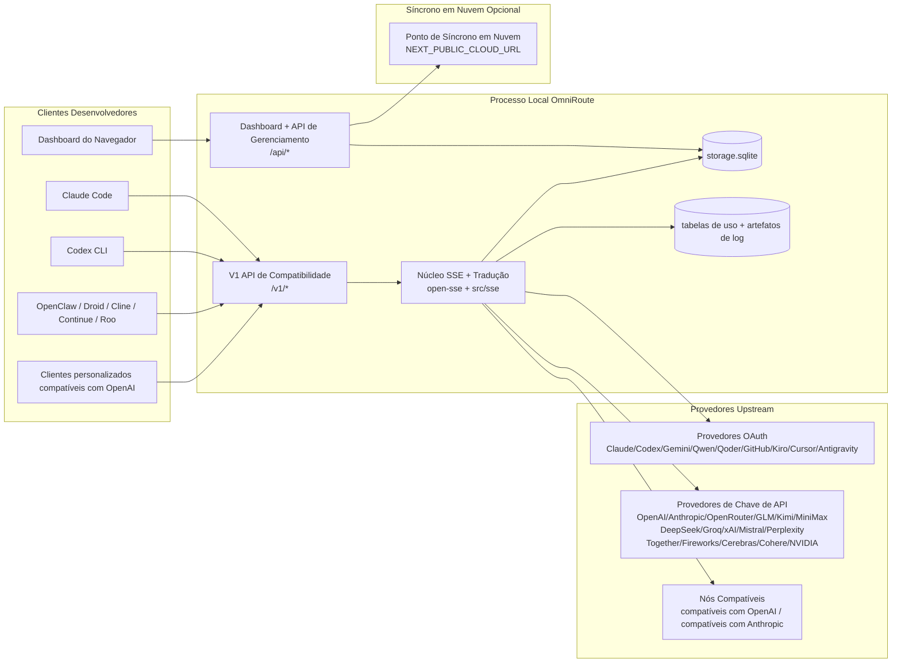
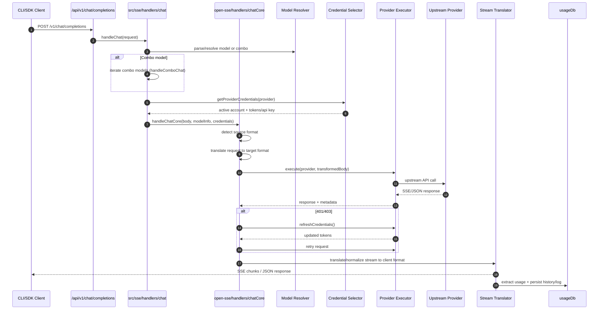
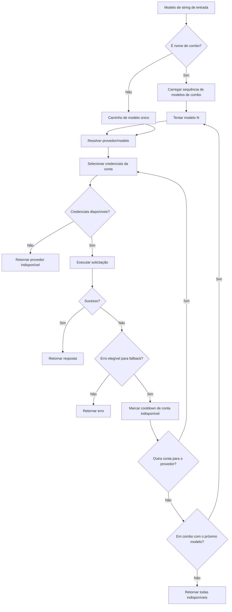
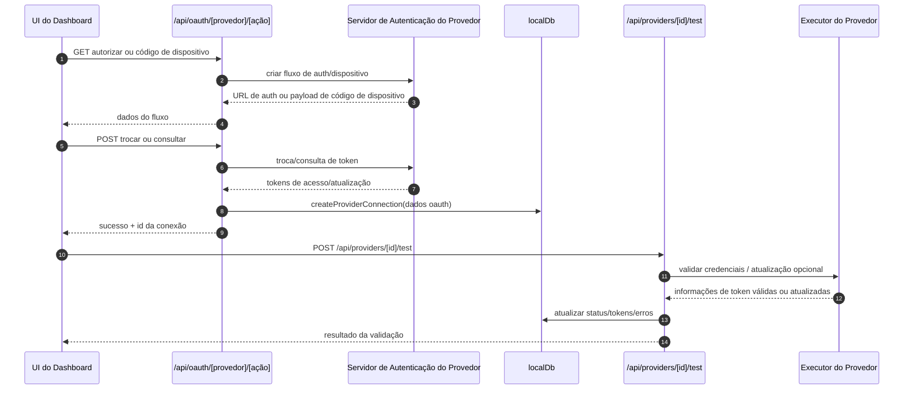
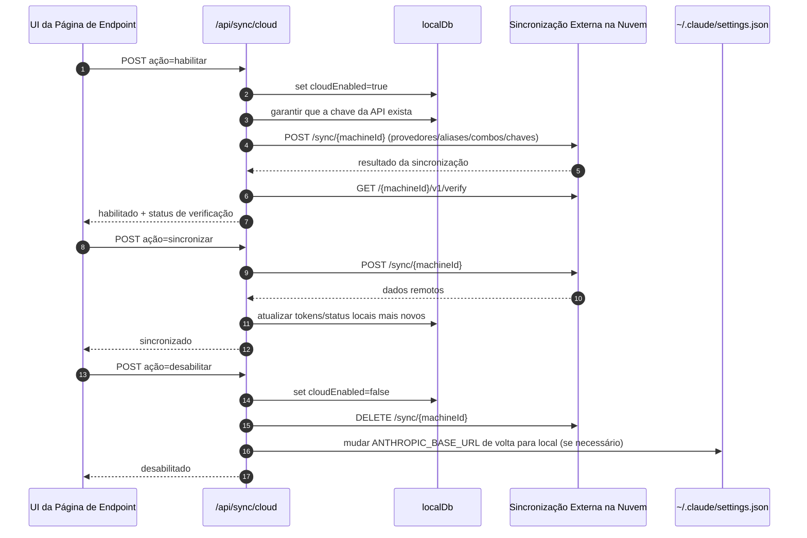
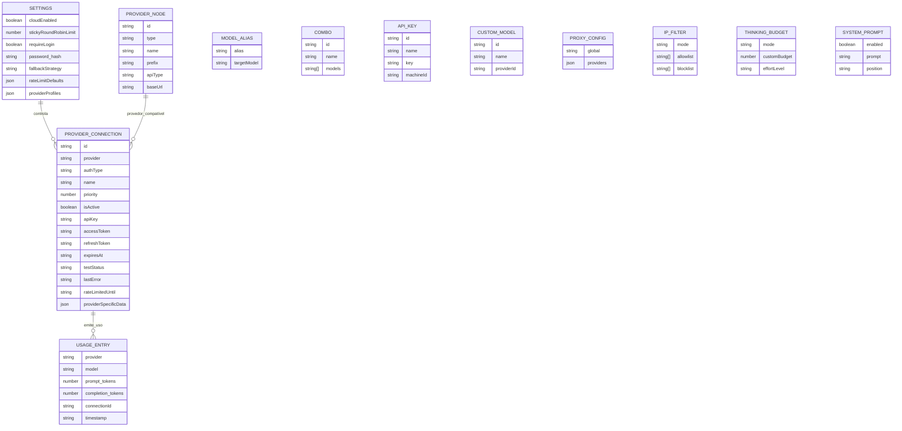
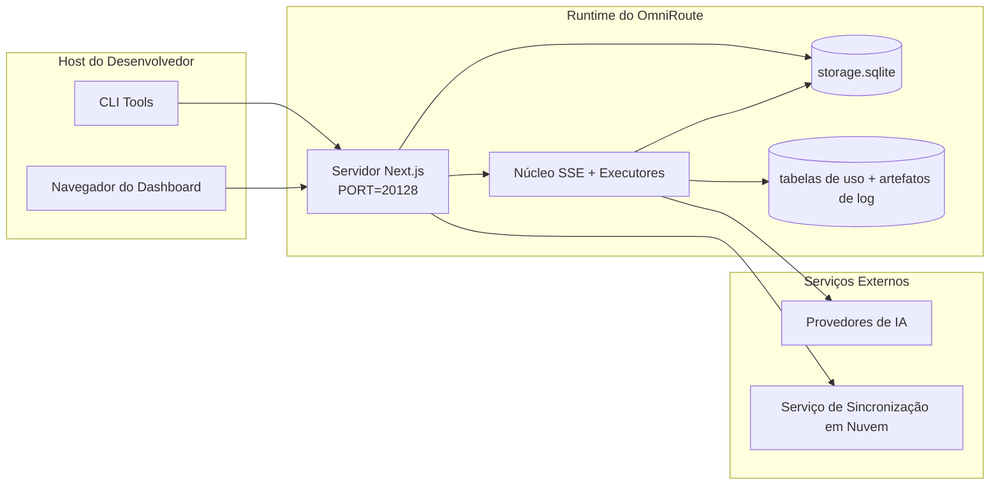

# ARCHITECTURE (Português (Brasil))

🌐 **Languages:** 🇺🇸 [English](../../../../architecture/ARCHITECTURE.md) · 🇸🇦 [ar](../../../ar/docs/architecture/ARCHITECTURE.md) · 🇦🇿 [az](../../../az/docs/architecture/ARCHITECTURE.md) · 🇧🇬 [bg](../../../bg/docs/architecture/ARCHITECTURE.md) · 🇧🇩 [bn](../../../bn/docs/architecture/ARCHITECTURE.md) · 🇨🇿 [cs](../../../cs/docs/architecture/ARCHITECTURE.md) · 🇩🇰 [da](../../../da/docs/architecture/ARCHITECTURE.md) · 🇩🇪 [de](../../../de/docs/architecture/ARCHITECTURE.md) · 🇪🇸 [es](../../../es/docs/architecture/ARCHITECTURE.md) · 🇮🇷 [fa](../../../fa/docs/architecture/ARCHITECTURE.md) · 🇫🇮 [fi](../../../fi/docs/architecture/ARCHITECTURE.md) · 🇫🇷 [fr](../../../fr/docs/architecture/ARCHITECTURE.md) · 🇮🇳 [gu](../../../gu/docs/architecture/ARCHITECTURE.md) · 🇮🇱 [he](../../../he/docs/architecture/ARCHITECTURE.md) · 🇮🇳 [hi](../../../hi/docs/architecture/ARCHITECTURE.md) · 🇭🇺 [hu](../../../hu/docs/architecture/ARCHITECTURE.md) · 🇮🇩 [id](../../../id/docs/architecture/ARCHITECTURE.md) · 🇮🇩 [in](../../../in/docs/architecture/ARCHITECTURE.md) · 🇮🇹 [it](../../../it/docs/architecture/ARCHITECTURE.md) · 🇯🇵 [ja](../../../ja/docs/architecture/ARCHITECTURE.md) · 🇰🇷 [ko](../../../ko/docs/architecture/ARCHITECTURE.md) · 🇮🇳 [mr](../../../mr/docs/architecture/ARCHITECTURE.md) · 🇲🇾 [ms](../../../ms/docs/architecture/ARCHITECTURE.md) · 🇳🇱 [nl](../../../nl/docs/architecture/ARCHITECTURE.md) · 🇳🇴 [no](../../../no/docs/architecture/ARCHITECTURE.md) · 🇵🇭 [phi](../../../phi/docs/architecture/ARCHITECTURE.md) · 🇵🇱 [pl](../../../pl/docs/architecture/ARCHITECTURE.md) · 🇵🇹 [pt](../../../pt/docs/architecture/ARCHITECTURE.md) · 🇷🇴 [ro](../../../ro/docs/architecture/ARCHITECTURE.md) · 🇷🇺 [ru](../../../ru/docs/architecture/ARCHITECTURE.md) · 🇸🇰 [sk](../../../sk/docs/architecture/ARCHITECTURE.md) · 🇸🇪 [sv](../../../sv/docs/architecture/ARCHITECTURE.md) · 🇰🇪 [sw](../../../sw/docs/architecture/ARCHITECTURE.md) · 🇮🇳 [ta](../../../ta/docs/architecture/ARCHITECTURE.md) · 🇮🇳 [te](../../../te/docs/architecture/ARCHITECTURE.md) · 🇹🇭 [th](../../../th/docs/architecture/ARCHITECTURE.md) · 🇹🇷 [tr](../../../tr/docs/architecture/ARCHITECTURE.md) · 🇺🇦 [uk-UA](../../../uk-UA/docs/architecture/ARCHITECTURE.md) · 🇵🇰 [ur](../../../ur/docs/architecture/ARCHITECTURE.md) · 🇻🇳 [vi](../../../vi/docs/architecture/ARCHITECTURE.md) · 🇨🇳 [zh-CN](../../../zh-CN/docs/architecture/ARCHITECTURE.md)

---

---

title: "Arquitetura do OmniRoute"
version: 3.8.0
lastUpdated: 2026-05-13

---

# Arquitetura do OmniRoute

🌐 **Idiomas:** 🇺🇸 [English](./ARCHITECTURE.md) | 🇧🇷 [Português (Brasil)](../i18n/pt-BR/docs/architecture/ARCHITECTURE.md) | 🇪🇸 [Español](../i18n/es/docs/architecture/ARCHITECTURE.md) | 🇫🇷 [Français](../i18n/fr/docs/architecture/ARCHITECTURE.md) | 🇮🇹 [Italiano](../i18n/it/docs/architecture/ARCHITECTURE.md) | 🇷🇺 [Русский](../i18n/ru/docs/architecture/ARCHITECTURE.md) | 🇨🇳 [中文 (简体)](../i18n/zh-CN/docs/architecture/ARCHITECTURE.md) | 🇩🇪 [Deutsch](../i18n/de/docs/architecture/ARCHITECTURE.md) | 🇮🇳 [हिन्दी](../i18n/in/docs/architecture/ARCHITECTURE.md) | 🇹🇭 [ไทย](../i18n/th/docs/architecture/ARCHITECTURE.md) | 🇺🇦 [Українська](../i18n/uk-UA/docs/architecture/ARCHITECTURE.md) | 🇸🇦 [العربية](../i18n/ar/docs/architecture/ARCHITECTURE.md) | 🇯🇵 [日本語](../i18n/ja/docs/architecture/ARCHITECTURE.md) | 🇻🇳 [Tiếng Việt](../i18n/vi/docs/architecture/ARCHITECTURE.md) | 🇧🇬 [Български](../i18n/bg/docs/architecture/ARCHITECTURE.md) | 🇩🇰 [Dansk](../i18n/da/docs/architecture/ARCHITECTURE.md) | 🇫🇮 [Suomi](../i18n/fi/docs/architecture/ARCHITECTURE.md) | 🇮🇱 [עברית](../i18n/he/docs/architecture/ARCHITECTURE.md) | 🇭🇺 [Magyar](../i18n/hu/docs/architecture/ARCHITECTURE.md) | 🇮🇩 [Bahasa Indonesia](../i18n/id/docs/architecture/ARCHITECTURE.md) | 🇰🇷 [한국어](../i18n/ko/docs/architecture/ARCHITECTURE.md) | 🇲🇾 [Bahasa Melayu](../i18n/ms/docs/architecture/ARCHITECTURE.md) | 🇳🇱 [Nederlands](../i18n/nl/docs/architecture/ARCHITECTURE.md) | 🇳🇴 [Norsk](../i18n/no/docs/architecture/ARCHITECTURE.md) | 🇵🇹 [Português (Portugal)](../i18n/pt/docs/architecture/ARCHITECTURE.md) | 🇷🇴 [Română](../i18n/ro/docs/architecture/ARCHITECTURE.md) | 🇵🇱 [Polski](../i18n/pl/docs/architecture/ARCHITECTURE.md) | 🇸🇰 [Slovenčina](../i18n/sk/docs/architecture/ARCHITECTURE.md) | 🇸🇪 [Svenska](../i18n/sv/docs/architecture/ARCHITECTURE.md) | 🇵🇭 [Filipino](../i18n/phi/docs/architecture/ARCHITECTURE.md) | 🇨🇿 [Čeština](../i18n/cs/docs/architecture/ARCHITECTURE.md)

_Última atualização: 2026-05-13_

## Resumo Executivo

OmniRoute é um gateway de roteamento de IA local e um painel construído sobre Next.js.  
Ele fornece um único endpoint compatível com OpenAI (`/v1/*`) e roteia o tráfego entre vários provedores upstream com tradução, fallback, atualização de token e rastreamento de uso.

Capacidades principais:

- Superfície de API compatível com OpenAI para CLI/ferramentas (177 provedores, 38 executores)
- Tradução de solicitação/resposta entre formatos de provedores
- Fallback de combinação de modelos (sequência de múltiplos modelos)
- Passos de combinação estruturados (`provedor + modelo + conexão`) com ordenação em tempo de execução por `compositeTiers`
- Fallback em nível de conta (multi-conta por provedor)
- Pré-verificação de cota e seleção de conta P2C ciente da cota no caminho principal de chat
- Gerenciamento de conexão de provedor OAuth + chave de API (14 módulos OAuth)
- Geração de embeddings via `/v1/embeddings` (6 provedores, 9 modelos)
- Geração de imagens via `/v1/images/generations` (10+ provedores, 20+ modelos)
- Transcrição de áudio via `/v1/audio/transcriptions` (7 provedores)
- Texto para fala via `/v1/audio/speech` (10 provedores)
- Geração de vídeo via `/v1/videos/generations` (ComfyUI + SD WebUI)
- Geração de música via `/v1/music/generations` (ComfyUI)
- Pesquisa na web via `/v1/search` (5 provedores)
- Moderações via `/v1/moderations`
- Reclassificação via `/v1/rerank`
- Análise de tags de pensamento (``) para modelos de raciocínio
- Sanitização de resposta para compatibilidade estrita com o SDK da OpenAI
- Normalização de papéis (desenvolvedor→sistema, sistema→usuário) para compatibilidade entre provedores
- Conversão de saída estruturada (json_schema → Gemini responseSchema)
- Persistência local para provedores, chaves, aliases, combos, configurações, preços (26 módulos de DB)
- Rastreamento de uso/custo e registro de solicitações
- Sincronização em nuvem opcional para sincronização multi-dispositivo/estado
- Lista de permissão/bloqueio de IP para controle de acesso à API
- Gerenciamento de orçamento de pensamento (pass-through/auto/custom/adaptive)
- Injeção de prompt global
- Rastreamento de sessão e identificação
- Limitação de taxa aprimorada por conta com perfis específicos de provedores
- Padrão de disjuntor para resiliência do provedor
- Proteção contra rebanho de trovão com bloqueio mutex
- Cache de deduplicação de solicitação baseado em assinatura
- Camada de domínio: regras de custo, política de fallback, política de bloqueio
- Context Relay: resumos de transferência de sessão para continuidade de rotação de conta
- Persistência de estado de domínio (cache de gravação SQLite para fallbacks, orçamentos, bloqueios, disjuntores)
- Motor de política para avaliação centralizada de solicitações (bloqueio → orçamento → fallback)
- Telemetria de solicitação com agregação de latência p50/p95/p99
- Telemetria de alvo de combo e saúde histórica do alvo de combo via `combo_execution_key` / `combo_step_id`
- ID de correlação (X-Request-Id) para rastreamento de ponta a ponta
- Registro de auditoria de conformidade com opção de exclusão por chave de API
- Estrutura de avaliação para garantia de qualidade de LLM
- Painel de saúde com status de disjuntor de provedor em tempo real
- Servidor MCP (37 ferramentas) com 3 transportes (stdio/SSE/Streamable HTTP)
- Servidor A2A (JSON-RPC 2.0 + SSE) com habilidades e ciclo de vida de tarefas
- Sistema de memória (extração, injeção, recuperação, sumarização)
- Sistema de habilidades (registro, executor, sandbox, habilidades integradas)
- Proxy MITM com gerenciamento de certificados e manipulação de DNS
- Middleware de proteção contra injeção de prompt
- Pipeline de compressão de prompt com Caveman, RTK, pipelines empilhados, combos de compressão, pacotes de idioma e análises
- Registro de ACP (Agent Communication Protocol)
- Provedores OAuth modulares (14 módulos individuais sob `src/lib/oauth/providers/`)
- Scripts de desinstalação/desinstalação completa
- Ação de reparo de ambiente OAuth
- Ponte WebSocket para clientes WS compatíveis com OpenAI (`/v1/ws`)
- Gerenciamento de token de sincronização (emissão/revogação, download de pacote de configuração versionado por ETag)
- Pensamento GLM (`glmt`) como preset de provedor de primeira classe
- Contagem híbrida de tokens (lado do provedor `/messages/count_tokens` com fallback de estimativa)
- Auto-semeadura de alias de modelo (30+ normalizações de dialeto cross-proxy na inicialização)
- Busca segura de saída com proteção SSRF, bloqueio de URL privada e retry configurável
- Repetições de chat cientes de cooldown com `requestRetry` e `maxRetryIntervalSec` configuráveis
- Validação do ambiente de execução com Zod na inicialização
- Auditoria de conformidade v2 com paginação, eventos CRUD de provedores e registro de validação bloqueada por SSRF

Modelo de execução principal:

- Rotas de aplicativo Next.js sob `src/app/api/*` implementam tanto APIs de painel quanto APIs de compatibilidade
- Um núcleo compartilhado de SSE/roteamento em `src/sse/*` + `open-sse/*` lida com execução de provedores, tradução, streaming, fallback e uso

## Diagramas de Referência

Fontes Mermaid canônicas e controladas por versão para a plataforma v3.8.0 estão em
[`docs/diagrams/`](../diagrams/README.md). Dois são reproduzidos abaixo para orientação;
os demais estão vinculados a seus guias específicos de domínio.


> Fonte: [diagrams/request-pipeline.mmd](../diagrams/request-pipeline.mmd)


> Fonte: [diagrams/resilience-3layers.mmd](../diagrams/resilience-3layers.mmd) — também vinculado a
> [RESILIENCE_GUIDE.md](./RESILIENCE_GUIDE.md) e à referência de resiliência `CLAUDE.md`.

## Escopo e Limites

### Dentro do Escopo

- Tempo de execução do gateway local
- APIs de gerenciamento do painel
- Autenticação de provedor e atualização de token
- Tradução de requisições e streaming SSE
- Persistência de estado local + uso
- Orquestração opcional de sincronização em nuvem

### Fora do Escopo

- Implementação de serviço em nuvem por trás de `NEXT_PUBLIC_CLOUD_URL`
- SLA do provedor/plano de controle fora do processo local
- Binaries CLI externos em si (Claude CLI, Codex CLI, etc.)

## Superfície do Painel (Atual)

Páginas principais em `src/app/(dashboard)/dashboard/`:

- `/dashboard` — início rápido + visão geral do provedor
- `/dashboard/endpoint` — proxy de endpoint + MCP + A2A + abas de endpoint API
- `/dashboard/providers` — conexões e credenciais do provedor
- `/dashboard/combos` — estratégias de combo, templates, construtor baseado em etapas, regras de roteamento de modelo, ordenação persistida manual
- `/dashboard/auto-combo` — Motor de Auto Combo: pesos de pontuação, pacotes de modo, predefinições de fábrica virtual, telemetria
- `/dashboard/costs` — agregação de custos e visibilidade de preços
- `/dashboard/analytics` — análises de uso, avaliações, saúde do alvo de combo
- `/dashboard/limits` — controles de cota/taxa
- `/dashboard/cli-tools` — integração CLI, detecção de tempo de execução, geração de configuração
- `/dashboard/agents` — agentes ACP detectados + registro de agente personalizado
- `/dashboard/cloud-agents` — tarefas de agente hospedadas na nuvem (Codex Cloud, Devin, Jules) e ciclo de vida da tarefa
- `/dashboard/skills` — registro de habilidades A2A, execução em sandbox, catálogo de habilidades embutido
- `/dashboard/memory` — inspeção e recuperação de memória conversacional persistente
- `/dashboard/webhooks` — assinaturas de webhook de saída, rotação de segredos, estatísticas de tentativas
- `/dashboard/batch` — submissão de trabalho em lote e progresso
- `/dashboard/cache` — estatísticas de cache de leitura e raciocínio, controles de expulsão
- `/dashboard/playground` — playground de chat interativo contra qualquer combo/modelo configurado
- `/dashboard/changelog` — visualizador de changelog no aplicativo (renderiza `CHANGELOG.md`)
- `/dashboard/system` — diagnósticos de tempo de execução, informações de versão, superfície de validação de ambiente
- `/dashboard/onboarding` — assistente de configuração para primeira execução para novas instalações
- `/dashboard/media` — playground de imagem/vídeo/música
- `/dashboard/search-tools` — teste de provedor de busca e histórico
- `/dashboard/health` — tempo de atividade, disjuntores, limites de taxa, sessões monitoradas por cota
- `/dashboard/logs` — logs de requisição/proxy/auditoria/console
- `/dashboard/settings` — abas de configurações do sistema (geral, roteamento, padrões de combo, etc.)
- `/dashboard/context/caveman` — regras de compressão Caveman, pacotes de idioma, visualização e modo de saída
- `/dashboard/context/rtk` — filtros de saída de comando RTK, visualização e configurações de segurança em tempo de execução
- `/dashboard/context/combos` — pipelines de compressão nomeados atribuídos a combos de roteamento
- `/dashboard/translator` — inspeção de tradutor e visualização de conversão de formato de requisição
- `/dashboard/audit` — navegador de log de auditoria de conformidade com paginação e metadados estruturados
- `/dashboard/usage` — navegador de uso por requisição vinculado a `usage_history`
- `/dashboard/compression` — análises de compressão, estatísticas e atribuição de pipeline
- `/dashboard/api-manager` — ciclo de vida da chave API e permissões de modelo

## Contexto do Sistema em Alto Nível



## Componentes Centrais de Execução

## 1) Camada de API e Roteamento (Rotas do App Next.js)

Principais diretórios:

- `src/app/api/v1/*` e `src/app/api/v1beta/*` para APIs de compatibilidade
- `src/app/api/*` para APIs de gerenciamento/configuração
- Reescritas do Next em `next.config.mjs` mapeiam `/v1/*` para `/api/v1/*`

Rotas de compatibilidade importantes:

- `src/app/api/v1/chat/completions/route.ts`
- `src/app/api/v1/messages/route.ts`
- `src/app/api/v1/responses/route.ts`
- `src/app/api/v1/models/route.ts` — inclui modelos personalizados com `custom: true`
- `src/app/api/v1/embeddings/route.ts` — geração de embeddings (6 provedores)
- `src/app/api/v1/images/generations/route.ts` — geração de imagens (4+ provedores, incluindo Antigravity/Nebius)
- `src/app/api/v1/messages/count_tokens/route.ts`
- `src/app/api/v1/providers/[provider]/chat/completions/route.ts` — chat dedicado por provedor
- `src/app/api/v1/providers/[provider]/embeddings/route.ts` — embeddings dedicados por provedor
- `src/app/api/v1/providers/[provider]/images/generations/route.ts` — imagens dedicadas por provedor
- `src/app/api/v1beta/models/route.ts`
- `src/app/api/v1beta/models/[...path]/route.ts`

Domínios de gerenciamento:

- Auth/configurações: `src/app/api/auth/*`, `src/app/api/settings/*`
- Provedores/conexões: `src/app/api/providers*`
- Nós de provedores: `src/app/api/provider-nodes*`
- Modelos personalizados: `src/app/api/provider-models` (GET/POST/DELETE)
- Catálogo de modelos: `src/app/api/models/route.ts` (GET)
- Configuração de proxy: `src/app/api/settings/proxy` (GET/PUT/DELETE) + `src/app/api/settings/proxy/test` (POST)
- OAuth: `src/app/api/oauth/*`
- Chaves/aliases/combos/preços: `src/app/api/keys*`, `src/app/api/models/alias`, `src/app/api/combos*`, `src/app/api/pricing`
- Uso: `src/app/api/usage/*`
- Síncrono/nuvem: `src/app/api/sync/*`, `src/app/api/cloud/*`
- Ferramentas auxiliares de CLI: `src/app/api/cli-tools/*`
- Filtro de IP: `src/app/api/settings/ip-filter` (GET/PUT)
- Orçamento de pensamento: `src/app/api/settings/thinking-budget` (GET/PUT)
- Prompt do sistema: `src/app/api/settings/system-prompt` (GET/PUT)
- Compressão: `src/app/api/settings/compression`, `src/app/api/compression/*`, e
  `src/app/api/context/*`
- Sessões: `src/app/api/sessions` (GET)
- Limites de taxa: `src/app/api/rate-limits` (GET)
- Resiliência: `src/app/api/resilience` (GET/PATCH) — fila de requisições, cooldown de conexão, quebra de provedor, configuração de espera por cooldown
- Reset de resiliência: `src/app/api/resilience/reset` (POST) — resetar quebras de provedores
- Estatísticas de cache: `src/app/api/cache/stats` (GET/DELETE)
- Telemetria: `src/app/api/telemetry/summary` (GET)
- Orçamento: `src/app/api/usage/budget` (GET/POST)
- Cadeias de fallback: `src/app/api/fallback/chains` (GET/POST/DELETE)
- Auditoria de conformidade: `src/app/api/compliance/audit-log` (GET, com paginação + metadados estruturados)
- Avaliações: `src/app/api/evals` (GET/POST), `src/app/api/evals/[suiteId]` (GET)
- Políticas: `src/app/api/policies` (GET/POST)
- Tokens de síncrono: `src/app/api/sync/tokens` (GET/POST), `src/app/api/sync/tokens/[id]` (GET/DELETE)
- Pacote de configuração: `src/app/api/sync/bundle` (GET, snapshot versionado em ETag de configurações/provedores/combos/chaves)
- WebSocket: `src/app/api/v1/ws/route.ts` — Manipulador de upgrade para clientes WS compatíveis com OpenAI

## 2) SSE + Núcleo de Tradução

Módulos do fluxo principal:

- Entrada: `src/sse/handlers/chat.ts`
- Orquestração central: `open-sse/handlers/chatCore.ts`
- Adaptadores de execução do provedor: `open-sse/executors/*`
- Detecção de formato/configuração do provedor: `open-sse/services/provider.ts`
- Análise/resolução de modelo: `src/sse/services/model.ts`, `open-sse/services/model.ts`
- Lógica de fallback de conta: `open-sse/services/accountFallback.ts`
- Registro de tradução: `open-sse/translator/index.ts`
- Transformações de stream: `open-sse/utils/stream.ts`, `open-sse/utils/streamHandler.ts`
- Extração/normalização de uso: `open-sse/utils/usageTracking.ts`
- Analisador de tags de pensamento: `open-sse/utils/thinkTagParser.ts`
- Manipulador de embeddings: `open-sse/handlers/embeddings.ts`
- Registro de provedores de embeddings: `open-sse/config/embeddingRegistry.ts`
- Manipulador de geração de imagem: `open-sse/handlers/imageGeneration.ts`
- Registro de provedores de imagem: `open-sse/config/imageRegistry.ts`
- Sanitização de resposta: `open-sse/handlers/responseSanitizer.ts`
- Normalização de papel: `open-sse/services/roleNormalizer.ts`

Serviços (lógica de negócios):

- Seleção/classificação de conta: `open-sse/services/accountSelector.ts`
- Gerenciamento do ciclo de vida do contexto: `open-sse/services/contextManager.ts`
- Aplicação de filtro de IP: `open-sse/services/ipFilter.ts`
- Rastreamento de sessão: `open-sse/services/sessionManager.ts`
- Deduplicação de requisições: `open-sse/services/signatureCache.ts`
- Injeção de prompt do sistema: `open-sse/services/systemPrompt.ts`
- Gerenciamento de orçamento de pensamento: `open-sse/services/thinkingBudget.ts`
- Roteamento de modelo curinga: `open-sse/services/wildcardRouter.ts`
- Gerenciamento de limite de taxa: `open-sse/services/rateLimitManager.ts`
- Disjuntor: `open-sse/services/circuitBreaker.ts`
- Transferência de contexto: `open-sse/services/contextHandoff.ts` — geração e injeção de resumo de transferência para estratégia de retransmissão de contexto
- Compressão: `open-sse/services/compression/*` — compressão proativa antes da tradução do provedor;
  inclui regras de Caveman, filtros RTK, pipelines empilhados, combos de compressão, estatísticas e validação
- Recuperador de cota do Codex: `open-sse/services/codexQuotaFetcher.ts` — recupera a cota do Codex para decisões de transferência de contexto
- Retentativa ciente de cooldown: `src/sse/services/cooldownAwareRetry.ts` — retentativas de cooldown por modelo com `requestRetry` / `maxRetryIntervalSec` configuráveis
- Busca segura de saída: `src/shared/network/safeOutboundFetch.ts` — busca protegida de provedor/modelo com proteção SSRF, bloqueio de URL privada, retentativa e timeout
- Guarda de URL de saída: `src/shared/network/outboundUrlGuard.ts` — valida URLs de provedores contra faixas CIDR privadas/localhost
- Padrões de requisição do provedor: `open-sse/services/providerRequestDefaults.ts` — padrões de `maxTokens`, `temperature`, `thinkingBudgetTokens` a nível de provedor
- Constantes do provedor GLM: `open-sse/config/glmProvider.ts` — modelos GLM compartilhados, URLs de cota, timeout/padrões GLMT
- Upstream de antigravidade: `open-sse/config/antigravityUpstream.ts` — constantes de URL base e caminho de descoberta
- Constantes do cliente Codex: `open-sse/config/codexClient.ts` — valores de user-agent e versão do cliente versionados
- Semente de alias de modelo: `src/lib/modelAliasSeed.ts` — semeia 30+ aliases de dialetos cross-proxy na inicialização

Módulos da camada de domínio:

- Regras/orçamentos de custo: `src/lib/domain/costRules.ts`
- Política de fallback: `src/lib/domain/fallbackPolicy.ts`
- Resolvedor de combo: `src/lib/domain/comboResolver.ts`
- Política de bloqueio: `src/lib/domain/lockoutPolicy.ts`
- Motor de políticas: `src/domain/policyEngine.ts` — avaliação centralizada de bloqueio → orçamento → fallback
- Catálogo de códigos de erro: `src/lib/domain/errorCodes.ts`
- ID da requisição: `src/lib/domain/requestId.ts`
- Timeout de busca: `src/lib/domain/fetchTimeout.ts`
- Telemetria de requisição: `src/lib/domain/requestTelemetry.ts`
- Conformidade/auditoria: `src/lib/domain/compliance/index.ts`
- Executor de avaliação: `src/lib/domain/evalRunner.ts`
- Persistência do estado do domínio: `src/lib/db/domainState.ts` — CRUD SQLite para cadeias de fallback, orçamentos, histórico de custos, estado de bloqueio, disjuntores

Módulos do provedor OAuth (14 arquivos individuais em `src/lib/oauth/providers/`):

- Índice do registro: `src/lib/oauth/providers/index.ts`
- Provedores individuais: `claude.ts`, `codex.ts`, `gemini.ts`, `antigravity.ts`, `qoder.ts`, `qwen.ts`, `kimi-coding.ts`, `github.ts`, `kiro.ts`, `cursor.ts`, `kilocode.ts`, `cline.ts`, `windsurf.ts`, `gitlab-duo.ts`
- Wrapper fino: `src/lib/oauth/providers.ts` — re-exportações de módulos individuais

## Subsistemas Principais (v3.8.0)

### A. Motor de Combinação Automática

O Motor de Combinação Automática pontua e escolhe dinamicamente os alvos de roteamento no momento da solicitação, em vez de depender de uma definição de combinação estática. Ele alimenta a família de prefixos de modelo `auto/*`.

- Entrada do motor: `open-sse/services/autoCombo/` (`autoComboEngine.ts`,
  `scoringEngine.ts`, `virtualFactory.ts`, `modePacks.ts`)
- Resolvedor: `src/domain/comboResolver.ts` (detecção automática do prefixo `auto/`)
- Painel: `/dashboard/auto-combo`
- Telemetria: tabela SQLite `auto_combo_decisions`

Principais capacidades:

- **14 estratégias de roteamento** (prioridade, ponderada, preenchimento primeiro, round-robin, P2C, aleatório,
  menos utilizado, otimizado por custo, estritamente aleatório, **auto**, lkgp, otimizado por contexto,
  retransmissão de contexto, além de um caminho de fallback) — auto é a adição principal na v3.8.0.
- **Pontuação de 9 fatores**: custo, latência p95, taxa de sucesso, margem de cota, proximidade de bloqueio,
  estado do disjuntor, falhas recentes, disponibilidade do modelo e afinidade de tags.
- **Fábrica virtual** materializa combinações efêmeras quando nenhuma combinação nomeada correspondente
  existe, buscando candidatos de conexões de provedores ativos saudáveis.
- **Prefixos automáticos**: `auto/coding`, `auto/cheap`, `auto/fast`, `auto/offline`,
  `auto/smart`, `auto/lkgp` — cada um apoiado por um perfil de peso ajustado.
- **4 pacotes de modo**: coding, fast, cheap, smart — enviados como configurações de peso predefinidas
  chamáveis a partir do painel.

Para detalhes algorítmicos completos (fórmulas de fatores, ajuste de peso), veja
[`docs/routing/AUTO-COMBO.md`](../routing/AUTO-COMBO.md).

### B. Agentes de Nuvem

Os Agentes de Nuvem envolvem plataformas de código-agente hospedadas de terceiros (Codex Cloud, Devin,
Jules) por trás de um ciclo de vida de tarefa uniforme baseado em DB. Todos os pontos de criação/inspeção
de tarefas requerem autenticação de gerenciamento.

- Raiz do módulo: `src/lib/cloudAgent/` (`baseAgent.ts`, `registry.ts`, `api.ts`,
  `types.ts`, `db.ts`, além de subdiretórios por agente em `agents/`)
- Implementações por agente: `agents/codex/`, `agents/devin/`, `agents/jules/`
- Pontos finais públicos: `/api/v1/agents/tasks/*` (listar/criar/obter/cancelar)
- Pontos finais de gerenciamento: `/api/cloud/*` (provisionamento, status, lote)
- Painel: `/dashboard/cloud-agents`
- Armazenamento: tabela `cloud_agent_tasks`

Para detalhes de provisionamento por agente e especificidades do OAuth, veja
[`docs/frameworks/CLOUD_AGENT.md`](../frameworks/CLOUD_AGENT.md).

### C. Guardrails

O módulo de guardrails é uma camada de middleware recarregável que inspeciona solicitações
e respostas em busca de PII, injeção de prompt e conteúdo de visão inseguro. Violações
interrompem a solicitação com HTTP **503** além de um código de erro estruturado, permitindo
que chamadores subsequentes tentem novamente ou ramifiquem.

- Raiz do módulo: `src/lib/guardrails/` (`base.ts`, `registry.ts`, `piiMasker.ts`,
  `promptInjection.ts`, `visionBridge.ts`, `visionBridgeHelpers.ts`)
- Recarregamento a quente: o registro observa alterações de configuração e reconstrói a cadeia no local
- Pontos de conexão: entrada do manipulador de chat, manipulador de geração de imagem, sanitizador de resposta
- Contrato HTTP: violações aparecem como `503` com `error.code = "GUARDRAIL_VIOLATION"`

Para autoria de regras e ajuste de limiares, veja
[`docs/security/GUARDRAILS.md`](../security/GUARDRAILS.md).

### D. Camada de Domínio

O namespace `src/domain/` centraliza decisões de política para que os manipuladores de rota não
precisem montar a lógica de bloqueio/orçamento/fallback por conta própria.

- Motor de política: `src/domain/policyEngine.ts` — ponto de entrada único para
  avaliação pré-execução (bloqueio → orçamento → ordem de fallback)
- Regras de custo: `src/domain/costRules.ts`
- Política de fallback: `src/domain/fallbackPolicy.ts`
- Política de bloqueio: `src/domain/lockoutPolicy.ts`
- Roteamento baseado em tags: `src/domain/tagRouter.ts`
- Resolvedor de combinação: `src/domain/comboResolver.ts` — resolve nomes de combinação, prefixos auto/\*
  e alvos de modelo curinga para planos de execução concretos
- Conector de regras de conexão/modelo: `src/domain/connectionModelRules.ts`
- Instantâneas de disponibilidade do modelo: `src/domain/modelAvailability.ts`
- Rastreamento de expiração de provedores: `src/domain/providerExpiration.ts`
- Cache de cota: `src/domain/quotaCache.ts`
- Estado de degradação: `src/domain/degradation.ts`
- Auditoria de configuração: `src/domain/configAudit.ts`
- Construtor de metadados de resposta OmniRoute: `src/domain/omnirouteResponseMeta.ts`
- Subsistema de avaliação: `src/domain/assessment/` — trabalhos de avaliação periódica

### E. Pipeline de Autorização

O pipeline de autorização classifica cada solicitação recebida e aplica a
cadeia de políticas apropriada antes do despacho.

- Entrada do pipeline: `src/server/authz/pipeline.ts`
- Classificador de solicitações: `src/server/authz/classify.ts` — distingue rotas de compatibilidade públicas
  de rotas de gerenciamento
- Inventário de rotas públicas: `src/shared/constants/publicApiRoutes.ts`
- Políticas: `src/server/authz/policies/` — predicados compostáveis
  (`requireApiKey`, `requireManagement`, `requireFreshAuth`, etc.)
- Utilitários de cabeçalho: `src/server/authz/headers.ts`
- Helper de asserção: `src/server/authz/assertAuth.ts`
- Contexto da solicitação: `src/server/authz/context.ts`

Rotas públicas vs rotas de gerenciamento são uma fronteira rígida: APIs de agente/cooldown e
mutações de provedores requerem autenticação de gerenciamento (HTTP 401 se ausente).

Para as regras completas de classificação de rotas, veja
[`docs/architecture/AUTHZ_GUIDE.md`](./AUTHZ_GUIDE.md).

### F. FSM de Workflow e Roteador Consciente de Tarefas

Um roteador acionado por máquina de estados finitos, posicionado acima da seleção de combinações para direcionar
o tráfego com base na fase de workflow detectada (planejamento, execução,
revisão) e afinidade de tarefas em segundo plano.

- FSM de Workflow: `open-sse/services/workflowFSM.ts`
- Roteador consciente de tarefas: `open-sse/services/taskAwareRouter.ts`
- Detector de tarefas em segundo plano: `open-sse/services/backgroundTaskDetector.ts`
- Classificador de intenção: `open-sse/services/intentClassifier.ts`

As transições da FSM alimentam a pontuação do Auto Combo, tendendo a modelos mais baratos
para tarefas de automação/em segundo plano e a modelos mais fortes para planejamento/revisão interativa.

### G. Resiliência Específica do Provedor

Vários provedores enviam módulos dedicados de resiliência e furtividade que se aproveitam das
camadas globais de disjuntor / cooldown de conexão / bloqueio de modelo:

- Motor Antigravity 429: `open-sse/services/antigravity429Engine.ts` (rotaciona
  identidade, limpa cabeçalhos de resposta, controla créditos/rastreamento de versão via
  `antigravityCredits.ts`, `antigravityHeaderScrub.ts`, `antigravityHeaders.ts`,
  `antigravityIdentity.ts`, `antigravityObfuscation.ts`, `antigravityVersion.ts`)
- Política de cota ModelScope: `open-sse/services/modelscopePolicy.ts`
- Claude Code CCH (Handshake de Canal de Compatibilidade): `open-sse/services/claudeCodeCCH.ts`,
  além de `claudeCodeCompatible.ts`, `claudeCodeConstraints.ts`, `claudeCodeExtraRemap.ts`,
  `claudeCodeToolRemapper.ts`
- Modelagem de impressão digital do Claude Code: `open-sse/services/claudeCodeFingerprint.ts`
- Ofuscação do Claude Code: `open-sse/services/claudeCodeObfuscation.ts`
- Cliente TLS do ChatGPT: `open-sse/services/chatgptTlsClient.ts` (estilo de
  impersonação curl para sessões do ChatGPT-Web)
- Cache de imagem do ChatGPT: `open-sse/services/chatgptImageCache.ts`

Para o guia completo de furtividade e orientações operacionais, veja
[`docs/security/STEALTH_GUIDE.md`](../security/STEALTH_GUIDE.md).

### H. Webhooks, Cache de Raciocínio, Cache de Leitura

- **Webhooks** — despacho de saída para eventos de provedor/conta/tarefa.
  - Dispatcher: `src/lib/webhookDispatcher.ts`
  - Armazenamento: tabela SQLite `webhooks` (via `src/lib/db/webhooks.ts`)
  - Painel: `/dashboard/webhooks` (assinaturas, segredos, histórico de tentativas)
  - Para taxonomia de eventos e semântica de tentativas, veja [`docs/frameworks/WEBHOOKS.md`](../frameworks/WEBHOOKS.md).
- **Cache de Raciocínio** — blocos de raciocínio replays para provedores que emitem
  tokens de pensamento (Claude, GLMT, etc.) para que turnos consecutivos possam pular o re-pensamento.
  - Camada de DB: `src/lib/db/reasoningCache.ts`
  - Camada de serviço: `open-sse/services/reasoningCache.ts`
  - Para semântica de replay, veja [`docs/routing/REASONING_REPLAY.md`](../routing/REASONING_REPLAY.md).
- **Cache de Leitura** — cache de resposta de curta duração indexado por assinatura e usado para
  colapsar tentativas idênticas de SDKs upstream quebrados.
  - Camada de DB: `src/lib/db/readCache.ts`
  - Endpoint de estatísticas: `GET /api/cache/stats`, painel em `/dashboard/cache`

## 3) Camada de Persistência

Banco de dados de estado primário (SQLite):

- Infraestrutura principal: `src/lib/db/core.ts` (better-sqlite3, migrações, WAL)
- Fachada de re-exportação: `src/lib/localDb.ts` (camada de compatibilidade fina para chamadores)
- arquivo: `${DATA_DIR}/storage.sqlite` (ou `$XDG_CONFIG_HOME/omniroute/storage.sqlite` quando definido, caso contrário `~/.omniroute/storage.sqlite`)
- entidades (tabelas + namespaces KV): providerConnections, providerNodes, modelAliases, combos, apiKeys, settings, pricing, **customModels**, **proxyConfig**, **ipFilter**, **thinkingBudget**, **systemPrompt**

Persistência de uso:

- fachada: `src/lib/usageDb.ts` (módulos decompostos em `src/lib/usage/*`)
- tabelas SQLite em `storage.sqlite`: `usage_history`, `call_logs`, `proxy_logs`
- artefatos de arquivo opcionais permanecem para compatibilidade/debug (`${DATA_DIR}/log.txt`, `${DATA_DIR}/call_logs/`, `<repo>/logs/...`)
- arquivos JSON legados são migrados para SQLite por migrações de inicialização quando presentes

Banco de dados de estado de domínio (SQLite):

- `src/lib/db/domainState.ts` — operações CRUD para estado de domínio
- Tabelas (criadas em `src/lib/db/core.ts`): `domain_fallback_chains`, `domain_budgets`, `domain_cost_history`, `domain_lockout_state`, `domain_circuit_breakers`
- Padrão de cache write-through: Maps em memória são autoritativos em tempo de execução; mutações são escritas de forma síncrona no SQLite; o estado é restaurado do DB na inicialização a frio

## 4) Superfícies de Autenticação + Segurança

- Autenticação de cookie do painel: `src/proxy.ts`, `src/app/api/auth/login/route.ts`
- Geração/verificação de chave de API: `src/shared/utils/apiKey.ts`
- Segredos do provedor persistidos nas entradas de `providerConnections`
- Suporte a proxy de saída via `open-sse/utils/proxyFetch.ts` (variáveis de ambiente) e `open-sse/utils/networkProxy.ts` (configurável por provedor ou global)
- Proteção SSRF / URL de saída: `src/shared/network/outboundUrlGuard.ts` — bloqueia intervalos privados/loopback/link-local para todas as chamadas de provedor
- Validação do ambiente em tempo de execução: `src/lib/env/runtimeEnv.ts` — esquema Zod para todas as variáveis de ambiente, exibido como erros/avisos de inicialização
- Tokens de sincronização: `src/lib/db/syncTokens.ts` — tokens escopados para endpoints de download de pacotes de configuração; respaldados pela tabela SQLite `sync_tokens` (migração `024_create_sync_tokens.sql`)
- Autenticação de handshake WebSocket: `src/lib/ws/handshake.ts` — valida solicitações de upgrade WS via chave de API ou cookie de sessão

## 5) Sincronização na Nuvem

- Inicialização do agendador: `src/lib/initCloudSync.ts`, `src/shared/services/initializeCloudSync.ts`, `src/shared/services/modelSyncScheduler.ts`
- Tarefa periódica: `src/shared/services/cloudSyncScheduler.ts`
- Tarefa periódica: `src/shared/services/modelSyncScheduler.ts`
- Rota de controle: `src/app/api/sync/cloud/route.ts`

## Ciclo de Vida da Solicitação (`/v1/chat/completions`)



## Fluxo de Fallback de Combo + Conta



As decisões de fallback são impulsionadas por `open-sse/services/accountFallback.ts` usando códigos de status e heurísticas de mensagens de erro. O roteamento de combo adiciona uma proteção extra: 400s específicos do provedor, como bloqueio de conteúdo upstream e falhas de validação de função, são tratados como falhas locais do modelo, para que os alvos de combo posteriores ainda possam ser executados.

## Ciclo de Vida de Onboarding OAuth e Atualização de Token



A atualização durante o tráfego ao vivo é executada dentro de `open-sse/handlers/chatCore.ts` via executor `refreshCredentials()`.

## Ciclo de Vida de Sincronização na Nuvem (Habilitar / Sincronizar / Desabilitar)



A sincronização periódica é acionada por `CloudSyncScheduler` quando a nuvem está habilitada.

## Modelo de Dados e Mapa de Armazenamento



Arquivos de armazenamento físico:

- banco de dados de runtime primário: `${DATA_DIR}/storage.sqlite`
- linhas de log de requisições: `${DATA_DIR}/log.txt` (artefato de compat/debug)
- arquivos de payload de chamadas estruturadas: `${DATA_DIR}/call_logs/`
- sessões de depuração de tradutor/requisição opcionais: `<repo>/logs/...`

## Topologia de Implantação



## Mapeamento de Módulos (Crítico para Decisão)

### Módulos de Rota e API

- `src/app/api/v1/*`, `src/app/api/v1beta/*`: APIs de compatibilidade
- `src/app/api/v1/providers/[provider]/*`: rotas dedicadas por provedor (chat, embeddings, imagens)
- `src/app/api/providers*`: CRUD de provedores, validação, teste
- `src/app/api/provider-nodes*`: gerenciamento de nós compatíveis personalizados
- `src/app/api/provider-models`: gerenciamento de modelos personalizados (CRUD)
- `src/app/api/models/route.ts`: API de catálogo de modelos (aliases + modelos personalizados)
- `src/app/api/oauth/*`: fluxos de OAuth/código de dispositivo
- `src/app/api/keys*`: ciclo de vida da chave API local
- `src/app/api/models/alias`: gerenciamento de alias
- `src/app/api/combos*`: gerenciamento de combos de fallback
- `src/app/api/pricing`: substituições de preços para cálculo de custos
- `src/app/api/settings/proxy`: configuração de proxy (GET/PUT/DELETE)
- `src/app/api/settings/proxy/test`: teste de conectividade de proxy de saída (POST)
- `src/app/api/usage/*`: APIs de uso e logs
- `src/app/api/sync/*` + `src/app/api/cloud/*`: sincronização em nuvem e auxiliares voltados para a nuvem
- `src/app/api/cli-tools/*`: escritores/verificadores de configuração CLI local
- `src/app/api/settings/ip-filter`: lista de permissão/bloqueio de IP (GET/PUT)
- `src/app/api/settings/thinking-budget`: configuração do orçamento de tokens de pensamento (GET/PUT)
- `src/app/api/settings/system-prompt`: prompt do sistema global (GET/PUT)
- `src/app/api/settings/compression`: configurações de compressão global (GET/PUT)
- `src/app/api/compression/*`: visualização de compressão, metadados de regras e pacotes de idioma
- `src/app/api/context/caveman/config`: alias de configurações do Caveman (GET/PUT)
- `src/app/api/context/rtk/*`: configuração RTK, catálogo de filtros, endpoint de teste e recuperação de saída bruta
- `src/app/api/context/combos*`: CRUD de combos de compressão e atribuições de combos de roteamento
- `src/app/api/context/analytics`: alias de análises de compressão
- `src/app/api/sessions`: listagem de sessões ativas (GET)
- `src/app/api/rate-limits`: status de limite de taxa por conta (GET)
- `src/app/api/sync/tokens`: CRUD de tokens de sincronização (GET/POST)
- `src/app/api/sync/tokens/[id]`: obter/excluir token de sincronização (GET/DELETE)
- `src/app/api/sync/bundle`: download de pacote de configuração (GET, versionamento ETag)
- `src/app/api/v1/ws`: manipulador de atualização WebSocket para clientes WS compatíveis com OpenAI

### Núcleo de Roteamento e Execução

- `src/sse/handlers/chat.ts`: análise de requisições, manipulação de combos, loop de seleção de conta
- `open-sse/handlers/chatCore.ts`: tradução, despacho de executores, manipulação de retry/refresh, configuração de stream
- `open-sse/executors/*`: comportamento de rede e formato específico do provedor

### Registro de Tradução e Conversores de Formato

- `open-sse/translator/index.ts`: registro e orquestração de tradutores
- Tradutores de requisição: `open-sse/translator/request/*` (9 módulos — `antigravity-to-openai`, `claude-to-gemini`, `claude-to-openai`, `gemini-to-openai`, `openai-responses`, `openai-to-claude`, `openai-to-cursor`, `openai-to-gemini`, `openai-to-kiro`)
- Tradutores de resposta: `open-sse/translator/response/*` (8 módulos — `claude-to-openai`, `cursor-to-openai`, `gemini-to-claude`, `gemini-to-openai`, `kiro-to-openai`, `openai-responses`, `openai-to-antigravity`, `openai-to-claude`)
- Auxiliares: `open-sse/translator/helpers/*` (8 módulos — `claudeHelper`, `geminiHelper`, `geminiToolsSanitizer`, `maxTokensHelper`, `openaiHelper`, `responsesApiHelper`, `schemaCoercion`, `toolCallHelper`)
- Constantes de formato: `open-sse/translator/formats.ts`
- Bootstrap e registro: `open-sse/translator/bootstrap.ts`, `open-sse/translator/registry.ts`
- Auxiliares de formato de imagem: `open-sse/translator/image/`

### Persistência

- `src/lib/db/*`: configuração/persistência de estado e domínio persistente no SQLite
- `src/lib/localDb.ts`: re-exportação de compatibilidade para módulos de DB
- `src/lib/usageDb.ts`: fachada de histórico de uso/logs de chamadas sobre tabelas SQLite

## Cobertura do Executor do Provedor (Padrão de Estratégia)

Cada provedor tem um executor especializado que estende `BaseExecutor` (em `open-sse/executors/base.ts`), que fornece construção de URL, construção de cabeçalhos, tentativas com retrocesso exponencial, ganchos de atualização de credenciais e o método de orquestração `execute()`.

| Executor                 | Provedor(es)                                                                                                                                                | Tratamento Especial                                                                  |
| ------------------------ | ----------------------------------------------------------------------------------------------------------------------------------------------------------- | ------------------------------------------------------------------------------------ |
| `DefaultExecutor`        | OpenAI, Claude, Gemini, Qwen, OpenRouter, GLM, Kimi, MiniMax, DeepSeek, Groq, xAI, Mistral, Perplexity, Together, Fireworks, Cerebras, Cohere, NVIDIA, etc. | Configuração dinâmica de URL/cabeçalho por provedor                                  |
| `AntigravityExecutor`    | Google Antigravity                                                                                                                                          | IDs de projeto/sessão personalizados, análise de Retry-After, ofuscação de 429       |
| `AzureOpenAIExecutor`    | Azure OpenAI                                                                                                                                                | Roteamento baseado em implantação, aplicação de consulta de api-version              |
| `BlackboxWebExecutor`    | Blackbox AI (modo web)                                                                                                                                      | Reversão de sessão web com emulação de impressão digital TLS                         |
| `ChatGPTWebExecutor`     | ChatGPT web                                                                                                                                                 | Gerenciamento de cliente TLS + cookie de sessão (`chatgptTlsClient.ts`)              |
| `ClaudeIdentityExecutor` | Claude.ai (caminho CCH)                                                                                                                                     | Pipelines de restrição + remapeamento de ferramentas, modelagem de impressão digital |
| `CliProxyApiExecutor`    | Provedores compatíveis com CLIProxyAPI                                                                                                                      | Manipulação personalizada de autenticação e protocolo                                |
| `CloudflareAiExecutor`   | Cloudflare Workers AI                                                                                                                                       | Injeção de ID de conta, rastreamento de uso baseado em Neurons                       |
| `CodexExecutor`          | OpenAI Codex                                                                                                                                                | Injeções de instruções do sistema, força de esforço de raciocínio                    |
| `CommandCodeExecutor`    | Código de Comando                                                                                                                                           | Rotação de cabeçalho por sessão + OAuth                                              |
| `CursorExecutor`         | Cursor IDE                                                                                                                                                  | Protocolo ConnectRPC, codificação Protobuf, assinatura de requisições via checksum   |
| `DevinCliExecutor`       | Devin CLI                                                                                                                                                   | Conexão do ciclo de vida da tarefa Devin via módulo de agente em nuvem               |
| `GeminiCLIExecutor`      | Gemini CLI                                                                                                                                                  | Ciclo de atualização de token OAuth do Google                                        |
| `GithubExecutor`         | GitHub Copilot                                                                                                                                              | Atualização de token do Copilot, cabeçalhos imitando VSCode                          |
| `GitlabExecutor`         | GitLab Duo                                                                                                                                                  | Roteamento baseado em projeto + OAuth do GitLab                                      |
| `GlmExecutor`            | Z.AI GLM (incl. preset `glmt`)                                                                                                                              | Consciente do orçamento de pensamento, constantes do preset GLMT                     |
| `GrokWebExecutor`        | xAI Grok web                                                                                                                                                | Reversão de sessão web, seleção de modo (pensar/padrão)                              |
| `KieExecutor`            | KIE                                                                                                                                                         | Emissão de token personalizada com âncoras de sessão rotativas                       |
| `KiroExecutor`           | AWS CodeWhisperer/Kiro                                                                                                                                      | Formato binário do AWS EventStream → conversão para SSE                              |
| `MuseSparkWebExecutor`   | Muse Spark (web)                                                                                                                                            | Reversão de sessão web com integração de imagem-mensagem                             |
| `NlpCloudExecutor`       | NLP Cloud                                                                                                                                                   | Formato de corpo de requisição específico do provedor                                |
| `OpenCodeExecutor`       | OpenCode                                                                                                                                                    | Configuração de provedor compatível com AI SDK                                       |
| `PerplexityWebExecutor`  | Perplexity web                                                                                                                                              | Reversão de sessão web para continuidade de chat                                     |
| `PetalsExecutor`         | Inferência distribuída Petals                                                                                                                               | Roteamento de enxame descentralizado                                                 |
| `PollinationsExecutor`   | Pollinations AI                                                                                                                                             | Nenhuma chave de API necessária, requisições limitadas por taxa                      |
| `PuterExecutor`          | Puter                                                                                                                                                       | Integração de provedor baseada em navegador                                          |
| `QoderExecutor`          | Qoder AI                                                                                                                                                    | Suporte a PAT e OAuth, nível gratuito multi-modelo                                   |
| `VertexExecutor`         | Google Vertex AI                                                                                                                                            | Autenticação de conta de serviço, endpoints baseados em região                       |
| `WindsurfExecutor`       | Windsurf (Codeium)                                                                                                                                          | Atualização de token de sessão + OAuth do Codeium                                    |

Todos os outros provedores (incluindo nós compatíveis personalizados) usam o `DefaultExecutor`.

## Matriz de Compatibilidade de Provedores

> **Nota:** A matriz abaixo é uma amostra representativa dos 177 provedores registrados no
> OmniRoute v3.8.0. Para a lista canônica e continuamente atualizada, consulte
> [`docs/reference/PROVIDER_REFERENCE.md`](../reference/PROVIDER_REFERENCE.md) (gerada automaticamente) ou a fonte
> de verdade em `src/shared/constants/providers.ts` (validada pelo Zod na carga).

| Provedor          | Formato          | Autenticação               | Stream           | Não-Stream | Atualização de Token | API de Uso           |
| ----------------- | ---------------- | -------------------------- | ---------------- | ---------- | -------------------- | -------------------- |
| Claude            | claude           | Chave de API / OAuth       | ✅               | ✅         | ✅                   | ⚠️ Somente Admin     |
| Gemini            | gemini           | Chave de API / OAuth       | ✅               | ✅         | ✅                   | ⚠️ Console da Nuvem  |
| Gemini CLI        | gemini-cli       | OAuth                      | ✅               | ✅         | ✅                   | ⚠️ Console da Nuvem  |
| Antigravity       | antigravity      | OAuth                      | ✅               | ✅         | ✅                   | ✅ API de cota total |
| OpenAI            | openai           | Chave de API               | ✅               | ✅         | ❌                   | ❌                   |
| Codex             | openai-responses | OAuth                      | ✅ forçado       | ❌         | ✅                   | ✅ Limites de taxa   |
| GitHub Copilot    | openai           | OAuth + Token Copilot      | ✅               | ✅         | ✅                   | ✅ Capturas de cota  |
| Cursor            | cursor           | Checksum personalizado     | ✅               | ✅         | ❌                   | ❌                   |
| Kiro              | kiro             | AWS SSO OIDC               | ✅ (EventStream) | ❌         | ✅                   | ✅ Limites de uso    |
| Qwen              | openai           | OAuth                      | ✅               | ✅         | ✅                   | ⚠️ Por solicitação   |
| Qoder             | openai           | OAuth / PAT                | ✅               | ✅         | ✅                   | ⚠️ Por solicitação   |
| Kilo Code         | openai           | OAuth                      | ✅               | ✅         | ✅                   | ❌                   |
| Cline             | openai           | OAuth                      | ✅               | ✅         | ✅                   | ❌                   |
| Kimi Coding       | openai           | OAuth                      | ✅               | ✅         | ✅                   | ❌                   |
| OpenRouter        | openai           | Chave de API               | ✅               | ✅         | ❌                   | ❌                   |
| GLM/Kimi/MiniMax  | claude           | Chave de API               | ✅               | ✅         | ❌                   | ❌                   |
| DeepSeek          | openai           | Chave de API               | ✅               | ✅         | ❌                   | ❌                   |
| Groq              | openai           | Chave de API               | ✅               | ✅         | ❌                   | ❌                   |
| xAI (Grok)        | openai           | Chave de API               | ✅               | ✅         | ❌                   | ❌                   |
| Mistral           | openai           | Chave de API               | ✅               | ✅         | ❌                   | ❌                   |
| Perplexity        | openai           | Chave de API               | ✅               | ✅         | ❌                   | ❌                   |
| Together AI       | openai           | Chave de API               | ✅               | ✅         | ❌                   | ❌                   |
| Fireworks AI      | openai           | Chave de API               | ✅               | ✅         | ❌                   | ❌                   |
| Cerebras          | openai           | Chave de API               | ✅               | ✅         | ❌                   | ❌                   |
| Cohere            | openai           | Chave de API               | ✅               | ✅         | ❌                   | ❌                   |
| NVIDIA NIM        | openai           | Chave de API               | ✅               | ✅         | ❌                   | ❌                   |
| Cloudflare AI     | openai           | Token de API + ID da conta | ✅               | ✅         | ❌                   | ❌                   |
| Pollinations      | openai           | Nenhum (sem chave)         | ✅               | ✅         | ❌                   | ❌                   |
| Scaleway AI       | openai           | Chave de API               | ✅               | ✅         | ❌                   | ❌                   |
| LongCat           | openai           | Chave de API               | ✅               | ✅         | ❌                   | ❌                   |
| Ollama Cloud      | openai           | Chave de API (opcional)    | ✅               | ✅         | ❌                   | ❌                   |
| HuggingFace       | openai           | Chave de API               | ✅               | ✅         | ❌                   | ❌                   |
| Nebius            | openai           | Chave de API               | ✅               | ✅         | ❌                   | ❌                   |
| SiliconFlow       | openai           | Chave de API               | ✅               | ✅         | ❌                   | ❌                   |
| Hyperbolic        | openai           | Chave de API               | ✅               | ✅         | ❌                   | ❌                   |
| Vertex AI         | gemini           | Conta de Serviço           | ✅               | ✅         | ✅                   | ⚠️ Console da Nuvem  |
| Puter             | openai           | Chave de API               | ✅               | ✅         | ❌                   | ❌                   |
| Command Code      | openai           | OAuth                      | ✅               | ✅         | ✅                   | ⚠️ Por solicitação   |
| Z.AI / GLM        | openai           | Chave de API / OAuth       | ✅               | ✅         | ❌                   | ❌                   |
| GLMT (preset)     | claude           | Chave de API               | ✅               | ✅         | ❌                   | ⚠️ Por solicitação   |
| Kimi Coding       | openai           | OAuth / Chave de API       | ✅               | ✅         | ✅                   | ❌                   |
| KIE               | openai           | Chave de API               | ✅               | ✅         | ❌                   | ❌                   |
| Windsurf          | openai           | OAuth (Codeium)            | ✅               | ✅         | ✅                   | ⚠️ Por solicitação   |
| GitLab Duo        | openai           | OAuth (GitLab)             | ✅               | ✅         | ✅                   | ❌                   |
| Devin CLI         | openai           | OAuth                      | ✅               | ✅         | ✅                   | ✅ API de Tarefas    |
| Codex Cloud       | openai-responses | OAuth                      | ✅               | ❌         | ✅                   | ✅ Limites de taxa   |
| Jules             | openai           | OAuth                      | ✅               | ✅         | ✅                   | ✅ API de Tarefas    |
| AgentRouter       | openai           | Chave de API               | ✅               | ✅         | ❌                   | ❌                   |
| ChatGPT-Web       | openai           | Cookie de sessão + TLS     | ✅               | ✅         | ❌                   | ❌                   |
| Grok-Web          | openai           | Cookie de sessão           | ✅               | ✅         | ❌                   | ❌                   |
| Perplexity-Web    | openai           | Cookie de sessão           | ✅               | ✅         | ❌                   | ❌                   |
| BlackBox-Web      | openai           | Cookie de sessão + TLS     | ✅               | ✅         | ❌                   | ❌                   |
| Muse-Spark-Web    | openai           | Cookie de sessão           | ✅               | ✅         | ❌                   | ❌                   |
| ModelScope        | openai           | Chave de API               | ✅               | ✅         | ❌                   | ⚠️ Política de cota  |
| BazaarLink        | openai           | Chave de API               | ✅               | ✅         | ❌                   | ❌                   |
| Petals            | openai           | Nenhum                     | ✅               | ✅         | ❌                   | ❌                   |
| Qoder             | openai           | OAuth / PAT                | ✅               | ✅         | ✅                   | ⚠️ Por solicitação   |
| OpenCode (Go/Zen) | openai           | OAuth                      | ✅               | ✅         | ✅                   | ❌                   |
| CLIProxyAPI       | openai           | Personalizado              | ✅               | ✅         | ❌                   | ❌                   |

## Cobertura de Tradução de Formato

Os formatos de origem detectados incluem:

- `openai`
- `openai-responses`
- `claude`
- `gemini`

Os formatos de destino incluem:

- OpenAI chat/Responses
- Claude
- Gemini/Gemini-CLI/Antigravity envelope
- Kiro
- Cursor

As traduções usam **OpenAI como o formato central** — todas as conversões passam pelo OpenAI como intermediário:

```
Formato de Origem → OpenAI (central) → Formato de Destino
```

As traduções são selecionadas dinamicamente com base na forma do payload de origem e no formato de destino do provedor.

Camadas de processamento adicionais no pipeline de tradução:

- **Sanitização de resposta** — Remove campos não padrão das respostas no formato OpenAI (tanto streaming quanto não streaming) para garantir conformidade estrita com o SDK
- **Normalização de função** — Converte `developer` → `system` para alvos que não são OpenAI; mescla `system` → `user` para modelos que rejeitam a função de sistema (GLM, ERNIE)
- **Extração de tag de pensamento** — Analisa blocos ``do conteúdo para o campo`reasoning_content`
- **Saída estruturada** — Converte `response_format.json_schema` do OpenAI para `responseMimeType` + `responseSchema` do Gemini

## Endpoints de API Suportados

| Endpoint                                           | Formato                   | Manipulador                                                                                    |
| -------------------------------------------------- | ------------------------- | ---------------------------------------------------------------------------------------------- |
| `POST /v1/chat/completions`                        | OpenAI Chat               | `src/sse/handlers/chat.ts`                                                                     |
| `POST /v1/messages`                                | Claude Messages           | Mesmo manipulador (detecção automática)                                                        |
| `POST /v1/responses`                               | OpenAI Responses          | `open-sse/handlers/responsesHandler.ts`                                                        |
| `POST /v1/embeddings`                              | OpenAI Embeddings         | `open-sse/handlers/embeddings.ts`                                                              |
| `GET /v1/embeddings`                               | Listagem de modelos       | Rota da API                                                                                    |
| `POST /v1/images/generations`                      | OpenAI Images             | `open-sse/handlers/imageGeneration.ts`                                                         |
| `GET /v1/images/generations`                       | Listagem de modelos       | Rota da API                                                                                    |
| `POST /v1/providers/{provider}/chat/completions`   | OpenAI Chat               | Dedicado por provedor com validação de modelo                                                  |
| `POST /v1/providers/{provider}/embeddings`         | OpenAI Embeddings         | Dedicado por provedor com validação de modelo                                                  |
| `POST /v1/providers/{provider}/images/generations` | OpenAI Images             | Dedicado por provedor com validação de modelo                                                  |
| `POST /v1/messages/count_tokens`                   | Contagem de Tokens Claude | Rota da API                                                                                    |
| `GET /v1/models`                                   | Lista de Modelos OpenAI   | Rota da API (chat + embedding + imagem + modelos personalizados)                               |
| `GET /api/models/catalog`                          | Catálogo                  | Todos os modelos agrupados por provedor + tipo                                                 |
| `POST /v1beta/models/*:streamGenerateContent`      | Nativo do Gemini          | Rota da API                                                                                    |
| `GET/PUT/DELETE /api/settings/proxy`               | Configuração de Proxy     | Configuração de proxy de rede                                                                  |
| `POST /api/settings/proxy/test`                    | Conectividade de Proxy    | Endpoint de teste de saúde/conectividade do proxy                                              |
| `GET/POST/DELETE /api/provider-models`             | Modelos de Provedor       | Metadados do modelo do provedor que sustentam modelos disponíveis personalizados e gerenciados |

## Manipulador de Bypass

O manipulador de bypass (`open-sse/utils/bypassHandler.ts`) intercepta solicitações conhecidas como "descartáveis" do Claude CLI — pings de aquecimento, extrações de título e contagens de tokens — e retorna uma **resposta falsa** sem consumir tokens do provedor upstream. Isso é acionado apenas quando o `User-Agent` contém `claude-cli`.

## Registro de Solicitações e Artefatos

O antigo registrador de solicitações baseado em arquivo (`open-sse/utils/requestLogger.ts`) é mantido apenas para compatibilidade com versões anteriores. O contrato de tempo de execução atual usa:

- `APP_LOG_TO_FILE=true` para logs de aplicação e auditoria gravados em `<repo>/logs/`
- Registros de log de chamadas com suporte a SQLite em `call_logs`
- Artefatos em `${DATA_DIR}/call_logs/YYYY-MM-DD/...` quando o pipeline de log de chamadas está habilitado

## Modos de Falha e Resiliência

## 1) Disponibilidade de Conta/Provedor

- cooldown de conexão em falhas upstream recuperáveis
- fallback de conta antes de falhar a solicitação
- fallback de modelo combinado quando o caminho atual de modelo/provedor é esgotado

## 2) Expiração de Token

- pré-verificação e atualização com nova tentativa para provedores atualizáveis
- nova tentativa 401/403 após tentativa de atualização no caminho principal

## 3) Segurança do Stream

- controlador de stream ciente de desconexões
- stream de tradução com descarte de fim de stream e tratamento de `[DONE]`
- fallback de estimativa de uso quando os metadados de uso do provedor estão ausentes

## 4) Degradação da Sincronização na Nuvem

- erros de sincronização são exibidos, mas o tempo de execução local continua
- o agendador possui lógica capaz de nova tentativa, mas a execução periódica atualmente chama a sincronização de tentativa única por padrão

## 5) Integridade dos Dados

- migrações de esquema SQLite e ganchos de autoatualização na inicialização
- caminho de compatibilidade de migração legado JSON → SQLite

## 6) SSRF / Proteção de URL de Saída

- `src/shared/network/outboundUrlGuard.ts` bloqueia todas as URLs de destino privadas/loopback/link-local antes que elas cheguem aos executores do provedor
- As rotas de descoberta e validação do modelo do provedor usam `src/shared/network/safeOutboundFetch.ts`, que aplica a proteção antes de cada solicitação de saída
- Erros de proteção aparecem como `URL_GUARD_BLOCKED` com HTTP 422 e são registrados na trilha de auditoria de conformidade via `providerAudit.ts`

## Observabilidade e Sinais Operacionais

Fontes de visibilidade em tempo de execução:

- logs do console de `src/sse/utils/logger.ts`
- agregados de uso por solicitação em SQLite (`usage_history`, `call_logs`, `proxy_logs`)
- capturas detalhadas de payload em quatro estágios em SQLite (`request_detail_logs`) quando `settings.detailed_logs_enabled=true`
- log de status de solicitação textual em `log.txt` (opcional/compat)
- arquivos de log de aplicação opcionais em `logs/` quando `APP_LOG_TO_FILE=true`
- artefatos de solicitação opcionais em `${DATA_DIR}/call_logs/` quando o pipeline de log de chamadas está habilitado
- endpoints de uso do dashboard (`/api/usage/*`) para consumo da UI

A captura detalhada do payload da solicitação armazena até quatro estágios de payload JSON por chamada roteada:

- solicitação bruta recebida do cliente
- solicitação traduzida realmente enviada para upstream
- resposta do provedor reconstruída como JSON; respostas transmitidas são compactadas para o resumo final mais metadados do stream
- resposta final do cliente retornada pelo OmniRoute; respostas transmitidas são armazenadas na mesma forma de resumo compacto

## Limites Sensíveis à Segurança

- O segredo do JWT (`JWT_SECRET`) protege a verificação/assinatura do cookie de sessão do painel
- A senha inicial de bootstrap (`INITIAL_PASSWORD`) deve ser configurada explicitamente para o provisionamento na primeira execução
- O segredo HMAC da chave da API (`API_KEY_SECRET`) protege o formato da chave da API local gerada
- Segredos do provedor (chaves/token da API) são persistidos no banco de dados local e devem ser protegidos a nível de sistema de arquivos
- Os endpoints de sincronização na nuvem dependem da autenticação da chave da API + semântica do ID da máquina

## Matriz de Ambiente e Tempo de Execução

Variáveis de ambiente ativamente usadas pelo código:

- App/auth: `JWT_SECRET`, `INITIAL_PASSWORD`
- Armazenamento: `DATA_DIR`
- Comportamento compatível do node: `ALLOW_MULTI_CONNECTIONS_PER_COMPAT_NODE`
- Substituição opcional da base de armazenamento (Linux/macOS quando `DATA_DIR` não estiver definido): `XDG_CONFIG_HOME`
- Hashing de segurança: `API_KEY_SECRET`, `MACHINE_ID_SALT`
- Registro: `APP_LOG_TO_FILE`, `APP_LOG_RETENTION_DAYS`, `CALL_LOG_RETENTION_DAYS`
- URL de sincronização/nuvem: `NEXT_PUBLIC_BASE_URL`, `NEXT_PUBLIC_CLOUD_URL`
- Proxy de saída: `HTTP_PROXY`, `HTTPS_PROXY`, `ALL_PROXY`, `NO_PROXY` e variantes em minúsculas
- Flags de recurso SOCKS5: `ENABLE_SOCKS5_PROXY`, `NEXT_PUBLIC_ENABLE_SOCKS5_PROXY`
- Auxiliares de plataforma/tempo de execução (não configuração específica do app): `APPDATA`, `NODE_ENV`, `PORT`, `HOSTNAME`

## Notas Arquitetônicas Conhecidas

1. `usageDb` e `localDb` compartilham a mesma política de diretório base (`DATA_DIR` -> `XDG_CONFIG_HOME/omniroute` -> `~/.omniroute`) com migração de arquivos legados.
2. `/api/v1/route.ts` delega ao mesmo construtor de catálogo unificado usado por `/api/v1/models` (`src/app/api/v1/models/catalog.ts`) para evitar desvios semânticos.
3. O registrador de requisições escreve cabeçalhos/corpo completos quando habilitado; trate o diretório de logs como sensível.
4. O comportamento na nuvem depende do correto `NEXT_PUBLIC_BASE_URL` e da acessibilidade do endpoint da nuvem.
5. O diretório `open-sse/` é publicado como o pacote de **workspace npm** `@omniroute/open-sse`. O código-fonte o importa via `@omniroute/open-sse/...` (resolvido pelo Next.js `transpilePackages`). Os caminhos de arquivo neste documento ainda usam o nome do diretório `open-sse/` para consistência.
6. Gráficos no painel usam **Recharts** (baseado em SVG) para visualizações analíticas acessíveis e interativas (gráficos de barras de uso de modelo, tabelas de quebra de provedor com taxas de sucesso).
7. Testes E2E usam **Playwright** (`tests/e2e/`), executados via `npm run test:e2e`. Testes unitários usam **Node.js test runner** (`tests/unit/`), executados via `npm run test:unit`. O código-fonte sob `src/` é **TypeScript** (`.ts`/`.tsx`); o workspace `open-sse/` permanece em JavaScript (`.js`).
8. A página de configurações é organizada em 7 abas: Geral, Aparência, IA, Segurança, Roteamento, Resiliência, Avançado. A página de Resiliência configura apenas a fila de requisições, o tempo de espera de conexão, o quebra-provedor e o comportamento de espera pelo tempo de espera; o estado de tempo de execução do quebra ao vivo é mostrado na página de Saúde.
9. A estratégia de **Context Relay** (`context-relay`) é dividida em duas camadas: `combo.ts` decide se uma transferência deve ser gerada, `chat.ts` injeta a transferência após a resolução da conta. Os dados da transferência vivem na tabela SQLite `context_handoffs`. Essa divisão é intencional porque apenas `chat.ts` sabe se a conta real mudou.
10. A **aplicação de proxy** agora é abrangente: `tokenHealthCheck.ts` resolve o proxy por conexão, `/api/providers/validate` usa `runWithProxyContext`, e `proxyFetch.ts` usa `undici.fetch()` para manter a compatibilidade do despachante no Node 22.
11. **Detecção de política de tempo de execução do Node.js**: `/api/settings/require-login` retorna os campos `nodeVersion` e `nodeCompatible`. A página de login renderiza um banner de aviso quando o tempo de execução está fora das linhas seguras suportadas do Node.js.

## Lista de Verificação de Verificação Operacional

- Compilar a partir do código-fonte: `npm run build`
- Construir imagem Docker: `docker build -t omniroute .`
- Iniciar serviço e verificar:
- `GET /api/settings`
- `GET /api/v1/models`
- A URL base do alvo da CLI deve ser `http://<host>:20128/v1` quando `PORT=20128`
